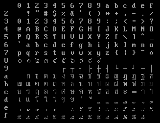

# Thai Character Encoding

## Kaset Thai character encoding

This was early Thai character encoding from Department of Computer Engineering, Kasetsart University.
It was used mainly in microcomputer hardware and software before TIS-620 standard.

The character encoding did not have Thai digit, `kho khuat (ฃ)`, `kho khon (ฅ)`, `tua lue (ฦ)`, `lak khang yao (ๅ)`, `Phinthu (อฺ) `, `Yamakkan (อ๎)`, `fong man (๏)`, `angkhan khu (๚)` and `kho mut (๛)`.

|    | 0 | 1 | 2 | 3 | 4 | 5 | 6 | 7 | 8 | 9 | A | B | C | D | E | F |
|:--:|:-:|:-:|:-:|:-:|:-:|:-:|:-:|:-:|:-:|:-:|:-:|:-:|:-:|:-:|:-:|:-:|
| 8x |
| 9x |
| Ax |   | ก | ข | ค | ฆ | ง | จ | ฉ | ช | ซ | ฌ | ญ | ฎ | ฏ | ฐ | ฑ |
| Bx | ฒ | ณ | ด | ต | ถ | ท | ธ | น | บ | ป | ผ | ฝ | พ | ฟ | ภ | ม |
| Cx | ย | ร | ฤ | ล | ว | ศ | ษ | ส | ห | ฬ | อ | ฮ | ะ |   | า | ำ |
| Dx | เ | แ | โ | ใ | ไ | ๆ | ฯ | ุ | ู | ิ | ี | ึ | ื | ั | ํ | ็ |
| Ex | ่ | ้ | ๊ | ๋ | ์ |
| Fx |

### Kaset-CW (Kaset CU-Writer)

Kaset-CW character encoding differs by adding Thai digit (90h-99h), `kho khuat (ฃ)` (9Ah), `kho khon (ฅ)` (9Bh), `tua lue (ฦ)` (CDh), `Phinthu (อฺ) ` (E5h), `Yamakkan (อ๎)` (FAh), `fong man (๏)` (FBh), `angkhan khu (๚)` (FCh), `kho mut (๛)` (FDh), box-drawing characters (80h-8Ah), Greek symbols and mathematics characters.

There was also other characters that can be insert with special character menu in CU-Writer that isn't in the table, top half of integral symbol in F5h and bottom half of integral symbol in F6h.

|    | 0 | 1 | 2 | 3 | 4 | 5 | 6 | 7 | 8 | 9 | A | B | C | D | E | F |
|:--:|:-:|:-:|:-:|:-:|:-:|:-:|:-:|:-:|:-:|:-:|:-:|:-:|:-:|:-:|:-:|:-:|
| 8x | ┌ | ┐ | └ | ┘ | │ | ─ | ├ | ┤ | ┴ | ┬ | ┼ |   |   |   |   |   |
| 9x | ๐ | ๑ | ๒ | ๓ | ๔ | ๕ | ๖ | ๗ | ๘ | ๙ | ฃ | ฅ |   |   |   |   |
| Ax |   | ก | ข | ค | ฆ | ง | จ | ฉ | ช | ซ | ฌ | ญ | ฎ | ฏ | ฐ | ฑ |
| Bx | ฒ | ณ | ด | ต | ถ | ท | ธ | น | บ | ป | ผ | ฝ | พ | ฟ | ภ | ม |
| Cx | ย | ร | ฤ | ล | ว | ศ | ษ | ส | ห | ฬ | อ | ฮ | ะ | ฦ | า | ำ |
| Dx | เ | แ | โ | ใ | ไ | ๆ | ฯ | ุ | ู | ิ | ี | ึ | ื | ั | ํ | ็ |
| Ex | ่ | ้ | ๊ | ๋ | ์ |  ฺ | α | β | γ | θ | ∫ | ∑ | √ | ∆ | ∇ | π |
| Fx |   | ρ | Φ |   | μ |   |   | ฿ |   |   |  ๎ | ๏ | ๚ | ๛ |   |   |

### Kaset-RW (Kaset Rajavithi Word PC)

Kaset-RW character encoding differs by adding Thai digit (80h-89h) and box-drawing characters (95h-9Fh).

**Note:** Early version 1.x did not have box-drawing characters and Thai digit, for numbers it will use Arabic number instead.

|    | 0 | 1 | 2 | 3 | 4 | 5 | 6 | 7 | 8 | 9 | A | B | C | D | E | F |
|:--:|:-:|:-:|:-:|:-:|:-:|:-:|:-:|:-:|:-:|:-:|:-:|:-:|:-:|:-:|:-:|:-:|
| 8x | ๐ | ๑ | ๒ | ๓ | ๔ | ๕ | ๖ | ๗ | ๘ | ๙ |
| 9x |   |   |   |   |   | ┌ | ┬ | ┐ | ├ | ┼ | ┤ | └ | ┴ | ┘ | ─ | │ |
| Ax |   | ก | ข | ค | ฆ | ง | จ | ฉ | ช | ซ | ฌ | ญ | ฎ | ฏ | ฐ | ฑ |
| Bx | ฒ | ณ | ด | ต | ถ | ท | ธ | น | บ | ป | ผ | ฝ | พ | ฟ | ภ | ม |
| Cx | ย | ร | ฤ | ล | ว | ศ | ษ | ส | ห | ฬ | อ | ฮ | ะ |   | า | ำ |
| Dx | เ | แ | โ | ใ | ไ | ๆ | ฯ | ุ | ู | ิ | ี | ึ | ื | ั | ํ | ็ |
| Ex | ่ | ้ | ๊ | ๋ | ์ |
| Fx |

Font used by Rajavithi Word PC

## TIS-620 Thai character encoding

Also known as Smo (สมอ.)

|    | 0 | 1 | 2 | 3 | 4 | 5 | 6 | 7 | 8 | 9 | A | B | C | D | E | F |
|:--:|:-:|:-:|:-:|:-:|:-:|:-:|:-:|:-:|:-:|:-:|:-:|:-:|:-:|:-:|:-:|:-:|
| 8x |
| 9x |
| Ax |   | ก | ข | ฃ | ค | ฅ | ฆ | ง | จ | ฉ | ช | ซ | ฌ | ญ | ฎ | ฏ |
| Bx | ฐ | ฑ | ฒ | ณ | ด | ต | ถ | ท | ธ | น | บ | ป | ผ | ฝ | พ | ฟ |
| Cx | ภ | ม | ย | ร | ฤ | ล | ฦ | ว | ศ | ษ | ส | ห | ฬ | อ | ฮ | ฯ |
| Dx | ะ | ั | า | ำ | ิ |  ี |  ึ |  ื |  ุ |  ู |  ฺ |   |   |   |   | ฿ |
| Ex | เ | แ | โ | ใ | ไ | ๅ | ๆ |  ็ |  ่ |  ้ |  ๊ |  ๋ |  ์ |  ํ |  ๎ | ๏ |
| Fx | ๐ | ๑ | ๒ | ๓ | ๔ | ๕ | ๖ | ๗ | ๘ | ๙ | ๚ | ๛ |

- [Wikipedia](https://en.wikipedia.org/wiki/Thai_Industrial_Standard_620-2533)
- [Official reference](http://www.nectec.or.th/it-standards/std620/std620.html) (in Thai)
- Announcement in Royal Gazette of [TIS 620-2533](https://web.archive.org/web/20111207224549/http://www.ratchakitcha.soc.go.th/DATA/PDF/2533/D/140/6318.PDF) and [TIS 620-2529](https://web.archive.org/web/20111207215038/http://www.ratchakitcha.soc.go.th/DATA/PDF/2529/D/102/2720.PDF)

### TIS-620-CW (TIS-620 CU-Writer)

TIS-620-CW differs by adding box-drawing characters, Greek symbols and mathematics characters.

There was also other characters that can be insert with special character menu in CU-Writer that isn't in the table, top half of integral symbol in 9Eh and bottom half of integral symbol in 9Fh.

|    | 0 | 1 | 2 | 3 | 4 | 5 | 6 | 7 | 8 | 9 | A | B | C | D | E | F |
|:--:|:-:|:-:|:-:|:-:|:-:|:-:|:-:|:-:|:-:|:-:|:-:|:-:|:-:|:-:|:-:|:-:|
| 8x | α | β | γ | θ | ∫ | ∑ | √ | ∆ | ∇ | π |   | ρ | Φ |   | μ | ┼ |
| 9x | ┴ | ┬ | ┤ | ├ |   | ─ | │ |   | ┌ | ┐ | └ | ┘ |   |   |   |   |
| Ax |   | ก | ข | ฃ | ค | ฅ | ฆ | ง | จ | ฉ | ช | ซ | ฌ | ญ | ฎ | ฏ |
| Bx | ฐ | ฑ | ฒ | ณ | ด | ต | ถ | ท | ธ | น | บ | ป | ผ | ฝ | พ | ฟ |
| Cx | ภ | ม | ย | ร | ฤ | ล | ฦ | ว | ศ | ษ | ส | ห | ฬ | อ | ฮ | ฯ |
| Dx | ะ | ั | า | ำ | ิ |  ี |  ึ |  ื |  ุ |  ู |  ฺ |   |   |   |   | ฿ |
| Ex | เ | แ | โ | ใ | ไ | ๅ | ๆ |  ็ |  ่ |  ้ |  ๊ |  ๋ |  ์ |  ํ |  ๎ | ๏ |
| Fx | ๐ | ๑ | ๒ | ๓ | ๔ | ๕ | ๖ | ๗ | ๘ | ๙ | ๚ | ๛ |

### TIS-620-RW (TIS-620 Rajavithi Word PC)

TIS-620-RW differs by adding box-drawing characters. It did not have `kho khuat (ฃ)`, `kho khon (ฅ)`, `tua lue (ฦ)`, `lak khang yao (ๅ)`, `Phinthu (อฺ) `, `Yamakkan (อ๎)`, `fong man (๏)`, `angkhan khu (๚)` and `kho mut (๛)` due to the software use Kaset character code internally and use it for display font.

|    | 0 | 1 | 2 | 3 | 4 | 5 | 6 | 7 | 8 | 9 | A | B | C | D | E | F |
|:--:|:-:|:-:|:-:|:-:|:-:|:-:|:-:|:-:|:-:|:-:|:-:|:-:|:-:|:-:|:-:|:-:|
| 8x |   |   |   |   |   |   |   |   |   |   |   |   |   |   |   | ┼ |
| 9x | ┴ | ┬ | ┤ | ├ |   | ─ | │ |   | ┌ | ┐ | └ | ┘ |   |   |   |   |
| Ax |   | ก | ข |   | ค |   | ฆ | ง | จ | ฉ | ช | ซ | ฌ | ญ | ฎ | ฏ |
| Bx | ฐ | ฑ | ฒ | ณ | ด | ต | ถ | ท | ธ | น | บ | ป | ผ | ฝ | พ | ฟ |
| Cx | ภ | ม | ย | ร | ฤ | ล |   | ว | ศ | ษ | ส | ห | ฬ | อ | ฮ | ฯ |
| Dx | ะ | ั | า | ำ | ิ |  ี |  ึ |  ื |  ุ |  ู |   |   |   |   |   |   |
| Ex | เ | แ | โ | ใ | ไ |   | ๆ |  ็ |  ่ |  ้ |  ๊ |  ๋ |  ์ |  ํ |   |   |
| Fx | ๐ | ๑ | ๒ | ๓ | ๔ | ๕ | ๖ | ๗ | ๘ | ๙ |

### TIS-620-CU (TIS-620 Computer Union)

TIS-620-CU differs by adding box-drawing characters. It did not have `Yamakkan (อ๎)` in EEh position.

|    | 0 | 1 | 2 | 3 | 4 | 5 | 6 | 7 | 8 | 9 | A | B | C | D | E | F |
|:--:|:-:|:-:|:-:|:-:|:-:|:-:|:-:|:-:|:-:|:-:|:-:|:-:|:-:|:-:|:-:|:-:|
| 8x |
| 9x |   |   |   |   |   |   |   |   |   | ┐ | ┘ | │ | ┼ | ┴ | ┬ | ├ |
| Ax |   | ก | ข | ฃ | ค | ฅ | ฆ | ง | จ | ฉ | ช | ซ | ฌ | ญ | ฎ | ฏ |
| Bx | ฐ | ฑ | ฒ | ณ | ด | ต | ถ | ท | ธ | น | บ | ป | ผ | ฝ | พ | ฟ |
| Cx | ภ | ม | ย | ร | ฤ | ล | ฦ | ว | ศ | ษ | ส | ห | ฬ | อ | ฮ | ฯ |
| Dx | ะ | ั | า | ำ | ิ |  ี |  ึ |  ื |  ุ |  ู |  ฺ | ─ |   | ┌ | └ | ฿ |
| Ex | เ | แ | โ | ใ | ไ | ๅ | ๆ |  ็ |  ่ |  ้ |  ๊ |  ๋ |  ์ |  ํ | ┤ | ๏ |
| Fx | ๐ | ๑ | ๒ | ๓ | ๔ | ๕ | ๖ | ๗ | ๘ | ๙ | ๚ | ๛ |
