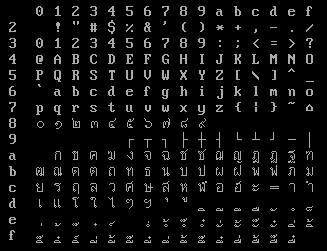
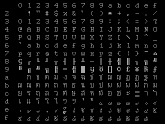

# Kaset (เกษตร) Thai character encoding

Kaset (เกษตร) or KU Thai character encoding is an early Thai character encoding from Department of Computer Engineering, Kasetsart University.
It was used mainly in microcomputer hardware and software before TIS-620 standard.

This character code seems to be originally develop on NEC PC-8001 from the character code table in "ประวัติและแนวทางการจัดมาตรฐานรหัสอักษรไทย ตอนที่ 1" article in "ไมโคร อิเลคทรอนิคส์" magazine, issue 8, page 67.

Kaset character encoding have 3 versions. Most variation of Kaset character encoding are based on Kaset v3.

---

## Kaset v1

From "ประวัติและแนวทางการจัดมาตรฐานรหัสอักษรไทย ตอนที่ 1" article in "ไมโคร อิเลคทรอนิคส์" magazine, issue 8.

The character encoding did not have Thai digit, `kho khuat (ฃ)`, `kho khon (ฅ)`, `tua lue (ฦ)`, `lak khang yao (ๅ)`, `phinthu (อฺ)`, `yamakkan (อ๎)`, `fong man (๏)`, `angkhan khu (๚)` and `kho mut (๛)` and `baht symbol (฿)`.

This character encoding is first used in dBASE II and TBASE (Thai dBASE clone run on CP/M).

**Note:**

Some characters are place in lower character table, `sara u (อุ)` is at 5Ch and `sara ar (า)` is at 7Ch.

|    | 0 | 1 | 2 | 3 | 4 | 5 | 6 | 7 | 8 | 9 | A | B | C | D | E | F |
|:--:|:-:|:-:|:-:|:-:|:-:|:-:|:-:|:-:|:-:|:-:|:-:|:-:|:-:|:-:|:-:|:-:|
| 2x | SP | ! | " | # | $ | % | & | ' | ( | ) | * | + | , | - | . | / |
| 3x | 0 | 1 | 2 | 3 | 4 | 5 | 6 | 7 | 8 | 9 | : | ; | <  | = | > | ? |
| 4x | @ | A | B | C | D | E | F | G | H | I | J | K | L | M | N | O |
| 5x | P | Q | R | S | T | U | V | W | X | Y | Z | [ |  ุ | ] | ^ | _ |
| 6x | ` | a | b | c | d | e | f | g | h | i | j | k | l | m | n | o |
| 7x | p | q | r | s | t | u | v | w | x | y | z | { | า | } | ~ |   |
| 8x |   |   |   |   |   |   |   |   |   |   |   |   |   |   |   |   |
| 9x |   |   |   |   |   |   |   |   |   |   |   |   |   |   |   |   |
| Ax |   | ก | ข | ค | ฆ | ง | จ | ฉ | ช | ซ | ฌ | ญ | ฎ | ฏ | ฐ | ฑ |
| Bx | ฒ | ณ | ด | ต | ถ | ท | ธ | น | บ | ป | ผ | ฝ | พ | ฟ | ภ | ม |
| Cx | ย | ร | ฤ | ล | ว | ศ | ษ | ส | ห | ฬ | อ | ฮ | ะ | เ | แ | โ |
| Dx | ใ | ไ |   |   |  ์ | ั |   |   |  ่ |  ้ |  ๊ |  ๋ |   |  ็ |  ู |   |
| Ex |   |   |   |   |   |   |   |   |   |   |   |   |   |   |   |   |
| Fx |   |   |   |   |   |   |  ิ |  ี |  ึ |  ื |   |   |   |   | ำ |   |

---

## Kaset v2

The character encoding did not have Thai digit, `kho khuat (ฃ)`, `kho khon (ฅ)`, `tua lue (ฦ)`, `lak khang yao (ๅ)`, `phinthu (อฺ)`, `yamakkan (อ๎)`, `fong man (๏)`, `angkhan khu (๚)` and `kho mut (๛)` and `baht symbol (฿)`.

Also include combined characters in the table. At 60h, 7Bh-7Dh, E8h-EBh, F1h-FBh, FDh-FEh.

**Note:**

Original table in the article didn't have `sara um (ำ)` and ` ั๋ ` combined character, these two characters placement is from Kaset-DTM.

Some characters are place in lower character table, `karan (อ์)` is at 5Bh, `mai yamok (ๆ)` is at 5Ch, `paiyan noi (ฯ)` is at 5Dh and combined characters at 60h and 7Bh-7Dh.

|    | 0 | 1 | 2 | 3 | 4 | 5 | 6 | 7 | 8 | 9 | A | B | C | D | E | F |
|:--:|:-:|:-:|:-:|:-:|:-:|:-:|:-:|:-:|:-:|:-:|:-:|:-:|:-:|:-:|:-:|:-:|
| 2x | SP | ! | " | # | $ | % | & | ' | ( | ) | * | + | , | - | . | / |
| 3x | 0 | 1 | 2 | 3 | 4 | 5 | 6 | 7 | 8 | 9 | : | ; | <  | = | > | ? |
| 4x | @ | A | B | C | D | E | F | G | H | I | J | K | L | M | N | O |
| 5x | P | Q | R | S | T | U | V | W | X | Y | Z |  ์ | ๆ | ฯ | ^ | _ |
| 6x |  ื้ | a | b | c | d | e | f | g | h | i | j | k | l | m | n | o |
| 7x | p | q | r | s | t | u | v | w | x | y | z |  ั่ |  ั้ |  ั๊ | ~ |   |
| 8x |   |   |   |   |   |   |   |   |   |   |   |   |   |   |   |   |
| 9x |   |   |   |   |   |   |   |   |   |   |   |   |   |   |   |   |
| Ax |   | ก | ข | ค | ฆ | ง | จ | ฉ | ช | ซ | ฌ | ญ | ฎ | ฏ | ฐ | ฑ |
| Bx | ฒ | ณ | ด | ต | ถ | ท | ธ | น | บ | ป | ผ | ฝ | พ | ฟ | ภ | ม |
| Cx | ย | ร | ฤ | ล | ว | ศ | ษ | ส | ห | ฬ | อ | ฮ | ะ | ั | า | ำ |
| Dx |  ิ |  ี |  ึ |  ื |  ุ |  ู | เ | แ | โ | ใ | ไ |  ่ |  ้ |  ๊ |  ๋ |  ็ |
| Ex |   |   |   |   |   |   |   |   |  ั๋ |  ิ่ |  ิ้ |  ิ๊ |   |   |   |   |
| Fx |   |  ิ๋ |  ิ์ |  ี่ |  ี้ |  ี๊ |  ี๋ |  ึ่ |  ึ้ |  ึ๊ |  ึ๋ |  ื่ |   |  ื๊ |  ื๋ |   |

### Kaset-NEC v2 (Kaset NEC PC-8001 v2)

From "ประวัติและแนวทางการจัดมาตรฐานรหัสอักษรไทย ตอนที่ 1" article in "ไมโคร อิเลคทรอนิคส์" magazine, issue 8 AND "ออกจอแก้ว" article in Micro Computer magazine, issue 3.

|    | 0 | 1 | 2 | 3 | 4 | 5 | 6 | 7 | 8 | 9 | A | B | C | D | E | F |
|:--:|:-:|:-:|:-:|:-:|:-:|:-:|:-:|:-:|:-:|:-:|:-:|:-:|:-:|:-:|:-:|:-:|
| 2x | SP | ! | " | # | $ | % | & | ' | ( | ) | * | + | , | - | . | / |
| 3x | 0 | 1 | 2 | 3 | 4 | 5 | 6 | 7 | 8 | 9 | : | ; | <  | = | > | ? |
| 4x | @ | A | B | C | D | E | F | G | H | I | J | K | L | M | N | O |
| 5x | P | Q | R | S | T | U | V | W | X | Y | Z |  ์ | ๆ | ฯ | ^ | _ |
| 6x |  ื้ | a | b | c | d | e | f | g | h | i | j | k | l | m | n | o |
| 7x | p | q | r | s | t | u | v | w | x | y | z |  ั่ |  ั้ |  ั๊ | ~ |   |
| 8x | ▁ | ▂ | ▃ | ▄ | ▅ | ▆ | ▇ | █ | ▏ | ▎ | ▍ | ▌ | ▋ | ▊ | ▉ | ┼ |
| 9x | ┴ | ┬ | ┤ | ├ | ▔ | ─ | │ | ▕ | ┌ | ┐ | └ | ┘ | ╭ | ╮ | ╰ | ╯ |
| Ax |   | ก | ข | ค | ฆ | ง | จ | ฉ | ช | ซ | ฌ | ญ | ฎ | ฏ | ฐ | ฑ |
| Bx | ฒ | ณ | ด | ต | ถ | ท | ธ | น | บ | ป | ผ | ฝ | พ | ฟ | ภ | ม |
| Cx | ย | ร | ฤ | ล | ว | ศ | ษ | ส | ห | ฬ | อ | ฮ | ะ | ั | า | ำ |
| Dx |  ิ |  ี |  ึ |  ื |  ุ |  ู | เ | แ | โ | ใ | ไ |  ่ |  ้ |  ๊ |  ๋ |  ็ |
| Ex | ═ | ╞ | ╪ | ╡ | 🭊 | 🬿 | 🭥 | 🭚 |  ั๋ |  ิ่ |  ิ้ |  ิ๊ | ● | ○ | ╱ | ╲ |
| Fx | ╳ |  ิ๋ |  ิ์ |  ี่ |  ี้ |  ี๊ |  ี๋ |  ึ่ |  ึ้ |  ึ๊ |  ึ๋ |  ื่ |   |  ื๊ |  ื๋ |   |

### Kaset-DTM (Kaset Datamat (ดาต้าแมท))

From MS-DOS 6.22 Thai Edition's THAICONV and ThaiSoft Thai System Manager (TSM) File Converter Utility.

Kaset-DTM character encoding differs by adding Thai digit (90h-99h), box-drawing characters (8Fh, E0h-E7h, EEh-EFh), `kho khuat (ฃ)` (9Ah), `kho khon (ฅ)` (9Bh), `tua lue (ฦ)` (FCh), `phinthu (อฺ)` (5Eh)  and `baht symbol (฿)` (F0h).

Also include combined characters in the table. At 60h, 7Bh-7Dh, E8h-EBh, F1h-FBh, FDh-FEh.

|    | 0 | 1 | 2 | 3 | 4 | 5 | 6 | 7 | 8 | 9 | A | B | C | D | E | F |
|:--:|:-:|:-:|:-:|:-:|:-:|:-:|:-:|:-:|:-:|:-:|:-:|:-:|:-:|:-:|:-:|:-:|
| 2x | SP | ! | " | # | $ | % | & | ' | ( | ) | * | + | , | - | . | / |
| 3x | 0 | 1 | 2 | 3 | 4 | 5 | 6 | 7 | 8 | 9 | : | ; | <  | = | > | ? |
| 4x | @ | A | B | C | D | E | F | G | H | I | J | K | L | M | N | O |
| 5x | P | Q | R | S | T | U | V | W | X | Y | Z |  ์ | ๆ | ฯ |  ฺ | _ |
| 6x |  ื้ | a | b | c | d | e | f | g | h | i | j | k | l | m | n | o |
| 7x | p | q | r | s | t | u | v | w | x | y | z |  ั่ |  ั้ |  ั๊ | ~ |   |
| 8x |   |   |   |   |   |   |   |   |   |   |   |   |   |   |   | ┼ |
| 9x | ๐ | ๑ | ๒ | ๓ | ๔ | ๕ | ๖ | ๗ | ๘ | ๙ | ฃ | ฅ |   |   |   |   |
| Ax |   | ก | ข | ค | ฆ | ง | จ | ฉ | ช | ซ | ฌ | ญ | ฎ | ฏ | ฐ | ฑ |
| Bx | ฒ | ณ | ด | ต | ถ | ท | ธ | น | บ | ป | ผ | ฝ | พ | ฟ | ภ | ม |
| Cx | ย | ร | ฤ | ล | ว | ศ | ษ | ส | ห | ฬ | อ | ฮ | ะ | ั | า | ำ |
| Dx |  ิ |  ี |  ึ |  ื |  ุ |  ู | เ | แ | โ | ใ | ไ |  ่ |  ้ |  ๊ |  ๋ |  ็ |
| Ex | ┌ | ┐ | └ | ┘ | ┤ | ├ | ┴ | ┬ |  ั๋ |  ิ่ |  ิ้ |  ิ๊ |   |   | │ | ─ |
| Fx | ฿ |  ิ๋ |  ิ์ |  ี่ |  ี้ |  ี๊ |  ี๋ |  ึ่ |  ึ้ |  ึ๊ |  ึ๋ |  ื่ | ฦ | ื๊ |  ื๋ |   |

---

## Kaset v3

The character encoding did not have Thai digit, `kho khuat (ฃ)`, `kho khon (ฅ)`, `tua lue (ฦ)`, `lak khang yao (ๅ)`, `phinthu (อฺ)`, `yamakkan (อ๎)`, `fong man (๏)`, `angkhan khu (๚)`, `kho mut (๛)` and `Baht symbol (฿)`.

Combined characters at E6h-FEh is only used by Thai Easy Writer file as I known of.

|    | 0 | 1 | 2 | 3 | 4 | 5 | 6 | 7 | 8 | 9 | A | B | C | D | E | F |
|:--:|:-:|:-:|:-:|:-:|:-:|:-:|:-:|:-:|:-:|:-:|:-:|:-:|:-:|:-:|:-:|:-:|
| 8x |   |   |   |   |   |   |   |   |   |   |   |   |   |   |   |   |
| 9x |   |   |   |   |   |   |   |   |   |   |   |   |   |   |   |   |
| Ax |   | ก | ข | ค | ฆ | ง | จ | ฉ | ช | ซ | ฌ | ญ | ฎ | ฏ | ฐ | ฑ |
| Bx | ฒ | ณ | ด | ต | ถ | ท | ธ | น | บ | ป | ผ | ฝ | พ | ฟ | ภ | ม |
| Cx | ย | ร | ฤ | ล | ว | ศ | ษ | ส | ห | ฬ | อ | ฮ | ะ |   | า | ำ |
| Dx | เ | แ | โ | ใ | ไ | ๆ | ฯ | ุ | ู | ิ | ี | ึ | ื | ั | ํ | ็ |
| Ex | ่ | ้ | ๊ | ๋ | ์ |   |  ํ่ |  ํ้ |  ํ๊ |  ํ๋ |  ั่ |  ั้ |  ั๊ |  ั๋ |  ิ่ |  ิ้ |
| Fx |  ิ๊ |  ิ๋ |  ิ์ |  ี่ |  ี้ |  ี๊ |  ี๋ |  ึ่ |  ึ้ |  ึ๊ |  ึ๋ |  ื่ |  ื้ |  ื๊ |  ื๋ |   |

Font used by Rajavithi Word PC, based on Kaset v3.

Thai Courier font shipped with Thai Easy Writer 4.1 from Computer Union, based on Kaset v3.

### Kaset-NEC v3 (Kaset NEC PC-8001 v3)

From "ประวัติและแนวทางการจัดมาตรฐานรหัสอักษรไทย ตอนที่ 1" article in "ไมโคร อิเลคทรอนิคส์" magazine, issue 8.

|    | 0 | 1 | 2 | 3 | 4 | 5 | 6 | 7 | 8 | 9 | A | B | C | D | E | F |
|:--:|:-:|:-:|:-:|:-:|:-:|:-:|:-:|:-:|:-:|:-:|:-:|:-:|:-:|:-:|:-:|:-:|
| 8x | ▁ | ▂ | ▃ | ▄ | ▅ | ▆ | ▇ | █ | ▏ | ▎ | ▍ | ▌ | ▋ | ▊ | ▉ | ┼ |
| 9x | ┴ | ┬ | ┤ | ├ | ▔ | ─ | │ | ▕ | ┌ | ┐ | └ | ┘ | ╭ | ╮ | ╰ | ╯ |
| Ax | ▒ | ก | ข | ค | ฆ | ง | จ | ฉ | ช | ซ | ฌ | ญ | ฎ | ฏ | ฐ | ฑ |
| Bx | ฒ | ณ | ด | ต | ถ | ท | ธ | น | บ | ป | ผ | ฝ | พ | ฟ | ภ | ม |
| Cx | ย | ร | ฤ | ล | ว | ศ | ษ | ส | ห | ฬ | อ | ฮ | ะ |   | า | ำ |
| Dx | เ | แ | โ | ใ | ไ | ๆ | ฯ | ุ | ู | ิ | ี | ึ | ื | ั | ํ | ็ |
| Ex | ่ | ้ | ๊ | ๋ | ์ |   |  ํ่ |  ํ้ |  ํ๊ |  ํ๋ |  ั่ |  ั้ |  ั๊ |  ั๋ |  ิ่ |  ิ้ |
| Fx |  ิ๊ |  ิ๋ |  ิ์ |  ี่ |  ี้ |  ี๊ |  ี๋ |  ึ่ |  ึ้ |  ึ๊ |  ึ๋ |  ื่ |  ื้ |  ื๊ |  ื๋ |   |

### Kaset-CW (Kaset CU-Writer)

Kaset-CW character encoding differs by adding Thai digit (90h-99h), `kho khuat (ฃ)` (9Ah), `kho khon (ฅ)` (9Bh), `tua lue (ฦ)` (CDh), `phinthu (อฺ)` (E5h), `yamakkan (อ๎)` (FAh), `fong man (๏)` (FBh), `angkhan khu (๚)` (FCh), `kho mut (๛)` (FDh), `Baht symbol (฿)` (E7h), box-drawing characters (80h-8Ah), Greek symbols and mathematics characters.

There was also other characters that can be insert with special character menu in CU-Writer that isn't in the table, top half of integral symbol in F5h and bottom half of integral symbol in F6h.

|    | 0 | 1 | 2 | 3 | 4 | 5 | 6 | 7 | 8 | 9 | A | B | C | D | E | F |
|:--:|:-:|:-:|:-:|:-:|:-:|:-:|:-:|:-:|:-:|:-:|:-:|:-:|:-:|:-:|:-:|:-:|
| 8x | ┌ | ┐ | └ | ┘ | │ | ─ | ├ | ┤ | ┴ | ┬ | ┼ |   |   |   |   |   |
| 9x | ๐ | ๑ | ๒ | ๓ | ๔ | ๕ | ๖ | ๗ | ๘ | ๙ | ฃ | ฅ |   |   |   |   |
| Ax |   | ก | ข | ค | ฆ | ง | จ | ฉ | ช | ซ | ฌ | ญ | ฎ | ฏ | ฐ | ฑ |
| Bx | ฒ | ณ | ด | ต | ถ | ท | ธ | น | บ | ป | ผ | ฝ | พ | ฟ | ภ | ม |
| Cx | ย | ร | ฤ | ล | ว | ศ | ษ | ส | ห | ฬ | อ | ฮ | ะ | ฦ | า | ำ |
| Dx | เ | แ | โ | ใ | ไ | ๆ | ฯ | ุ | ู | ิ | ี | ึ | ื | ั | ํ | ็ |
| Ex | ่ | ้ | ๊ | ๋ | ์ |  ฺ | α | β | γ | θ | ∫ | ∑ | √ | ∆ | ∇ | π |
| Fx |   | ρ | Φ |   | μ |   |   | ฿ |   |   |  ๎ | ๏ | ๚ | ๛ |   |   |

### Kaset-RW (Kaset Rajavithi Word PC)

Kaset-RW character encoding differs by adding Thai digit (80h-89h) and box-drawing characters (95h-9Fh).

**Note:**

Early version 1.x did not have box-drawing characters and Thai digit, for numbers it will use Arabic number instead.

|    | 0 | 1 | 2 | 3 | 4 | 5 | 6 | 7 | 8 | 9 | A | B | C | D | E | F |
|:--:|:-:|:-:|:-:|:-:|:-:|:-:|:-:|:-:|:-:|:-:|:-:|:-:|:-:|:-:|:-:|:-:|
| 8x | ๐ | ๑ | ๒ | ๓ | ๔ | ๕ | ๖ | ๗ | ๘ | ๙ |   |   |   |   |   |   |
| 9x |   |   |   |   |   | ┌ | ┬ | ┐ | ├ | ┼ | ┤ | └ | ┴ | ┘ | ─ | │ |
| Ax |   | ก | ข | ค | ฆ | ง | จ | ฉ | ช | ซ | ฌ | ญ | ฎ | ฏ | ฐ | ฑ |
| Bx | ฒ | ณ | ด | ต | ถ | ท | ธ | น | บ | ป | ผ | ฝ | พ | ฟ | ภ | ม |
| Cx | ย | ร | ฤ | ล | ว | ศ | ษ | ส | ห | ฬ | อ | ฮ | ะ |   | า | ำ |
| Dx | เ | แ | โ | ใ | ไ | ๆ | ฯ | ุ | ู | ิ | ี | ึ | ื | ั | ํ | ็ |
| Ex | ่ | ้ | ๊ | ๋ | ์ |   |  ํ่ |  ํ้ |  ํ๊ |  ํ๋ |  ั่ |  ั้ |  ั๊ |  ั๋ |  ิ่ |  ิ้ |
| Fx |  ิ๊ |  ิ๋ |  ิ์ |  ี่ |  ี้ |  ี๊ |  ี๋ |  ึ่ |  ึ้ |  ึ๊ |  ึ๋ |  ื่ |  ื้ |  ื๊ |  ื๋ |   |

### Kaset-VTHAI

Kaset code used in VTHAI driver. Kaset-VTHAI character encoding differs by adding Thai digit (90h-99h), `kho khuat (ฃ)` (9Ah), `kho khon (ฅ)` (9Bh), `tua lue (ฦ)` (CDh), `phinthu (อฺ)` (E5h), `fong man (๏)` (8Eh), `angkhan khu (๚)` (8Bh), `kho mut (๛)` (8Ch),  `yamakkan (อ๎)` (8Dh), `Baht symbol (฿)` (8Fh) and box-drawing characters (80h-8Ah) characters.

Use box-drawing characters code same as Kaset-CW

|    | 0 | 1 | 2 | 3 | 4 | 5 | 6 | 7 | 8 | 9 | A | B | C | D | E | F |
|:--:|:-:|:-:|:-:|:-:|:-:|:-:|:-:|:-:|:-:|:-:|:-:|:-:|:-:|:-:|:-:|:-:|
| 8x | ┌ | ┐ | └ | ┘ | │ | ─ | ├ | ┤ | ┴ | ┬ | ┼ | ๚ | ๛ |  ๎ | ๏ | ฿ |
| 9x | ๐ | ๑ | ๒ | ๓ | ๔ | ๕ | ๖ | ๗ | ๘ | ๙ | ฃ | ฅ |   |   |   |   |
| Ax |   | ก | ข | ค | ฆ | ง | จ | ฉ | ช | ซ | ฌ | ญ | ฎ | ฏ | ฐ | ฑ |
| Bx | ฒ | ณ | ด | ต | ถ | ท | ธ | น | บ | ป | ผ | ฝ | พ | ฟ | ภ | ม |
| Cx | ย | ร | ฤ | ล | ว | ศ | ษ | ส | ห | ฬ | อ | ฮ | ะ | ฦ | า | ำ |
| Dx | เ | แ | โ | ใ | ไ | ๆ | ฯ | ุ | ู | ิ | ี | ึ | ื | ั | ํ | ็ |
| Ex | ่ | ้ | ๊ | ๋ | ์ |   |  ํ่ |  ํ้ |  ํ๊ |  ํ๋ |  ั่ |  ั้ |  ั๊ |  ั๋ |  ิ่ |  ิ้ |
| Fx |  ิ๊ |  ิ๋ |  ิ์ |  ี่ |  ี้ |  ี๊ |  ี๋ |  ึ่ |  ึ้ |  ึ๊ |  ึ๋ |  ื่ |  ื้ |  ื๊ |  ื๋ |   |

### Kaset-IRC

Used in iRC Thai driver and MS-DOS 6.22 Thai Edition THAILS.

|    | 0 | 1 | 2 | 3 | 4 | 5 | 6 | 7 | 8 | 9 | A | B | C | D | E | F |
|:--:|:-:|:-:|:-:|:-:|:-:|:-:|:-:|:-:|:-:|:-:|:-:|:-:|:-:|:-:|:-:|:-:|
| 8x | ╩ | ╦ | ═ | ║ | ╥ | ╨ | ╫ | ┌ | ┘ | ┼ | ┌ | ┐ | └ | ┘ | │ | ─ |
| 9x | ╔ | ╝ | ╬ | ╗ | ╚ | ╠ | ╣ | ╤ | ╧ | ╪ | █ |   | ┴ | ┬ | ┤ | ├ |
| Ax |   | ก | ข | ค | ฆ | ง | จ | ฉ | ช | ซ | ฌ | ญ | ฎ | ฏ | ฐ | ฑ |
| Bx | ฒ | ณ | ด | ต | ถ | ท | ธ | น | บ | ป | ผ | ฝ | พ | ฟ | ภ | ม |
| Cx | ย | ร | ฤ | ล | ว | ศ | ษ | ส | ห | ฬ | อ | ฮ | ะ | ๏ | า | ำ |
| Dx | เ | แ | โ | ใ | ไ | ๆ | ฯ | ุ | ู | ิ | ี | ึ | ื | ั | ํ | ็ |
| Ex | ่ | ้ | ๊ | ๋ | ์ |   |   |   |   |   |   |   |   |   | ▓ |   |
| Fx | ๐ | ๑ | ๒ | ๓ | ๔ | ๕ | ๖ | ๗ | ๘ | ๙ | ├ | ๛ | ┤ | ╢ | ╟ | ░ |

### Kaset-THAIPRO

Used in Powersoft Thai Professional EGA/VGA driver.

|    | 0 | 1 | 2 | 3 | 4 | 5 | 6 | 7 | 8 | 9 | A | B | C | D | E | F |
|:--:|:-:|:-:|:-:|:-:|:-:|:-:|:-:|:-:|:-:|:-:|:-:|:-:|:-:|:-:|:-:|:-:|
| 8x | ฿ | ๚ | ๅ | ╪ | ← | ↑ | → | ↓ | ▄ | ┼ | ┌ | ┐ | └ | ┘ | │ | ─ |
| 9x | ๐ | ๑ | ๒ | ๓ | ๔ | ๕ | ๖ | ๗ | ๘ | ๙ | ฃ | ฅ | ┴ | ┬ | ┤ | ├ |
| Ax |   | ก | ข | ค | ฆ | ง | จ | ฉ | ช | ซ | ฌ | ญ | ฎ | ฏ | ฐ | ฑ |
| Bx | ฒ | ณ | ด | ต | ถ | ท | ธ | น | บ | ป | ผ | ฝ | พ | ฟ | ภ | ม |
| Cx | ย | ร | ฤ | ล | ว | ศ | ษ | ส | ห | ฬ | อ | ฮ | ะ | ฦ | า | ำ |
| Dx | เ | แ | โ | ใ | ไ | ๆ | ฯ | ุ | ู | ิ | ี | ึ | ื | ั | ํ | ็ |
| Ex | ่ | ้ | ๊ | ๋ | ์ |  ฺ |  ๎ | ๏ |   |   | ┌ | ┐ | └ | ┘ | │ | ─ |
| Fx | ╰ | ╭ | 🭚 | 🭥 | 🬿 | 🭊  | ╒ | ╕ | ╘ | ╛ | ═ | ╞ | ╡ | ╧ | ╤ |   |

### Kaset-MicroWiz

Used in MicroWiz XTRA-VGA driver.

|    | 0 | 1 | 2 | 3 | 4 | 5 | 6 | 7 | 8 | 9 | A | B | C | D | E | F |
|:--:|:-:|:-:|:-:|:-:|:-:|:-:|:-:|:-:|:-:|:-:|:-:|:-:|:-:|:-:|:-:|:-:|
| 8x | ░ | ▒ | ▓ |   |   |   |   |   |   | ฿ | ┌ | ┐ | └ | ┘ | │ | ─ |
| 9x | ๐ | ๑ | ๒ | ๓ | ๔ | ๕ | ๖ | ๗ | ๘ | ๙ | ┼ |   | ┴ | ┬ | ┤ | ├ |
| Ax |   | ก | ข | ค | ฆ | ง | จ | ฉ | ช | ซ | ฌ | ญ | ฎ | ฏ | ฐ | ฑ |
| Bx | ฒ | ณ | ด | ต | ถ | ท | ธ | น | บ | ป | ผ | ฝ | พ | ฟ | ภ | ม |
| Cx | ย | ร | ฤ | ล | ว | ศ | ษ | ส | ห | ฬ | อ | ฮ | ะ |   | า | ำ |
| Dx | เ | แ | โ | ใ | ไ | ๆ | ฯ | ุ | ู | ิ | ี | ึ | ื | ั | ํ | ็ |
| Ex | ่ | ้ | ๊ | ๋ | ์ |   |  ํ่ |  ํ้ |  ํ๊ |  ํ๋ |  ั่ |  ั้ |  ั๊ |  ั๋ |  ิ่ |  ิ้ |
| Fx |  ิ๊ |  ิ๋ |  ิ์ |  ี่ |  ี้ |  ี๊ |  ี๋ |  ึ่ |  ึ้ |  ึ๊ |  ึ๋ |  ื่ |  ื้ |  ื๊ |  ื๋ |   |

---

**Reference:**

* ยืน ภู่วรวรรณ. [เรื่องน่ารู้เกี่ยวกับไมโครคอมพิวเตอร์](https://archive.org/details/microcomputer). กรุงเทพฯ : ซีเอ็ดยูเคชั่น, 2527. ISBN 974-796-428-3.
* พิสุทธิ์ สถาพรภูริศักดิ์. (2527). [ประวัติและแนวทางการจัดมาตรฐานรหัสอักษรไทย ตอนที่ 1](https://archive.org/details/micro-electronics-magazine-issue-8/page/64/mode/2up). ไมโคร อิเลคทรอนิคส์, (8), 65-68.
* [std_to_ku and ku_to_std table from CU-Writer 1.41 source code](https://github.com/kytulendu/CW141/blob/master/SRC/COMMON/HDISP.ASM)
* [The character set of the PC-8001](https://commons.wikimedia.org/wiki/File:PC-8001_character_set.png)
