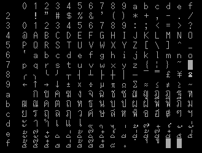
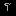
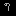

# Other Thai character encoding

## Code page 838 (CP838, IBM-838)

Also known as Thai EBCDIC.

|    | 0 | 1 | 2 | 3 | 4 | 5 | 6 | 7 | 8 | 9 | A | B | C | D | E | F |
|:--:|:-:|:-:|:-:|:-:|:-:|:-:|:-:|:-:|:-:|:-:|:-:|:-:|:-:|:-:|:-:|:-:|
| 0x |   |   |   |   |   |   |   |   |   |   |   |   |   |   |   |   |
| 1x |   |   |   |   |   |   |   |   |   |   |   |   |   |   |   |   |
| 2x |   |   |   |   |   |   |   |   |   |   |   |   |   |   |   |   |
| 3x |   |   |   |   |   |   |   |   |   |   |   |   |   |   |   |   |
| 4x |   |   | ก | ข | ฃ | ค | ฅ | ฆ | ง | [ | ¢ | . | < | ( | + | │ |
| 5x | & | ' | จ | ฉ | ช | ซ | ฌ | ญ | ฎ | ] | ! | $ | * | ) | ; | ¬ |
| 6x | - | / | ฏ | ฐ | ฑ | ฒ | ณ | ด | ต | ^ | ¦ | , | % | _ | > | ? |
| 7x | ฿ |  ๎ | ถ | ท | ธ | น | บ | ป | ผ | ` | : | # | @ | ' | = | " |
| 8x | ๏ | a | b | c | d | e | f | g | h | i | ฝ | พ | ฟ | ภ | ม | ย |
| 9x | ๚ | j | k | l | m | n | o | p | q | r | ร | ฤ | ล | ฦ | ว | ศ |
| Ax | ๛ | ~ | s | t | u | v | w | x | y | z | ษ | ส | ห | ฬ | อ | ฮ |
| Bx | ๐ | ๑ | ๒ | ๓ | ๔ | ๕ | ๖ | ๗ | ๘ | ๙ | ฯ | ะ | ั | า | ำ |  ิ |
| Cx | } | A | B | C | D | E | F | G | H | I |  ้ |  ี |  ึ |  ื |  ุ |  ู |
| Dx | { | J | K | L | M | N | O | P | Q | R |  ฺ | เ | แ | โ | ใ | ไ |
| Ex | \ |  ๊ | S | T | U | V | W | X | Y | Z | ๅ | ๆ |  ็ |  ่ |  ้ |  ๊ |
| Fx | 0 | 1 | 2 | 3 | 4 | 5 | 6 | 7 | 8 | 9 |  ๋ |  ์ |  ํ |  ๋ |  ์ |   |

## COMEDP or Fujitsu (Fujitsu Micro 8?)

From "ประวัติและแนวทางการจัดมาตรฐานรหัสอักษรไทย ตอนที่ 1" article in "ไมโคร อิเลคทรอนิคส์" magazine, issue 8.

**Note:**

May not correct due to how faded of the print are.

|    | 0 | 1 | 2 | 3 | 4 | 5 | 6 | 7 | 8 | 9 | A | B | C | D | E | F |
|:--:|:-:|:-:|:-:|:-:|:-:|:-:|:-:|:-:|:-:|:-:|:-:|:-:|:-:|:-:|:-:|:-:|
| 8x | ( | ) | ฉ | ฮ |  ฺ |  ์ | ? | ฒ | ฬ | ซ | ฐ | 9 | 8 | ญ | ศ | ▔ |
| 9x |  ั่ |  ั๊ |  ั๋ |  ิ์ |  ํ | ฤ | ฆ | ฦ | ┴ | ▏ | ▕ | = | ธ |  ํ | ฌ |  ็ |
| Ax |   |  ิ้ |  ิ๊ |  ิ๋ |  ี่ |  ี้ |  ี๊ |  ี๋ |  ึ่ |  ึ้ |  ึ๊ |  ึ๋ |  ื่ |  ื้ |  ื๊ |  ื๋ |
| Bx | │ | - |  ำ | ภ | ถ |  ุ | ะ | เ |  ้ | ง |  ิ | ป | ก | พ | ย | แ |
| Cx | ๆ | ฟ | ผ | ไ | ห |  ี | ร |   | ม | า | ด | อ | / | ช | ข |  ่ |
| Dx |  ื | _ | ฝ | ท |  ึ | ค | ต | น | ส | ใ | ว |  ิ่ | จ |  ั | บ | ล |
| Ex | = | ├ | ┤ |   | ฎ | ฑ | ฏ | โ | ณ | ฯ |  ๋ | ษ | ─ | , | │ | _ |
| Fx |  ๊ |   | 4 |  ู |  ั้ | 5 | 6 | 7 | " |   | 1 | 2 | 3 | 0 | ▒ |   |

## SMC (สหมิตรเครื่องกล)

From "ประวัติและแนวทางการจัดมาตรฐานรหัสอักษรไทย ตอนที่ 1" article in "ไมโคร อิเลคทรอนิคส์" magazine, issue 8.

|    | 0 | 1 | 2 | 3 | 4 | 5 | 6 | 7 | 8 | 9 | A | B | C | D | E | F |
|:--:|:-:|:-:|:-:|:-:|:-:|:-:|:-:|:-:|:-:|:-:|:-:|:-:|:-:|:-:|:-:|:-:|
| 8x |   |   |   |   |   |   |   |   |   |   |   |   |   |   |   |   |
| 9x |   |   |   |   |   |   |   |   |   |   |   |   |   |   |   |   |
| Ax |   |   |   | " | % | ( | ) | , | - | . | / | ? | _ |   | ๐ | ๑ |
| Bx | ๒ | ๓ | ๔ | ๕ | ๖ | ๗ | ๘ | ๙ |   | ๆ |  ็ |  ่ |  ้ |  ๊ |  ๋ |  ์ |
| Cx | ก | ข | ค | ฆ | ง | จ | ฉ | ช | ซ | ฌ | ญ | ฎ | ฏ | ฐ | ฑ | ฒ |
| Dx | ณ | ด | ต | ถ | ท | ธ | น | บ | ป | ผ | ฝ | พ | ฟ | ภ | ม | ย |
| Ex | ร | ฤ | ล | ฦ | ว | ศ | ษ | ส | ห | ฬ | อ | ฮ | ะ | ั | า | ำ |
| Fx |  ิ |  ี |  ึ |  ื |  ุ |  ู | ฯ |  ํ |  ฺ | เ | แ | โ | ใ | ไ |   |   |

## Loxley

From ThaiSoft Thai System Manager (TSM) File Converter Utility.

Used in Thai system in Sanco iBex and Olivetti computers distributed by Loxley Co.,Ltd.

|    | 0 | 1 | 2 | 3 | 4 | 5 | 6 | 7 | 8 | 9 | A | B | C | D | E | F |
|:--:|:-:|:-:|:-:|:-:|:-:|:-:|:-:|:-:|:-:|:-:|:-:|:-:|:-:|:-:|:-:|:-:|
| 8x | ┌ | ┐ | └ | ┘ | │ | ─ | ├ | ┤ | ┴ | ┬ | ┼ |   |   |   |   |   |
| 9x | ๐ | ๑ | ๒ | ๓ | ๔ | ๕ | ๖ | ๗ | ๘ | ๙ |  ิ์ |  ี่ |  ี้ |  ี๊ |  ี๋ |   |
| Ax |   | ก | ข | ค | ฆ | ง | จ | ฉ | ช | ซ | ฌ | ญ | ฎ | ฏ | ฐ | ฑ |
| Bx | ฒ | ณ | ด | ต | ถ | ท | ธ | น | บ | ป | ผ | ฝ | พ | ฟ | ภ | ม |
| Cx | ย | ร | ล | ว | ศ | ษ | ส | ห | ฬ | อ | ฮ | ฤ | ฦ | ะ | า | ำ |
| Dx | ั |  ็ |  ิ |  ี |  ึ |  ื |  ุ |  ู | เ | แ | โ | ใ | ไ | ่ | ้ | ๊  |
| Ex | ๋ | ์ | ๆ | ฯ |  ํ |  ั้ |  ั่ |  ั๊ |  ั๋ |  ิ่ |  ิ้ |  ิ๊ |  ิ๋ |  ิ์ |  ี่ |  ี้ |
| Fx |  ี๊ |  ี๋ |  ึ่ |  ึ้ |  ึ๊ |  ึ๋ |  ื่ |  ื้ |  ื๊ |  ื๋ | โ | ใ | ไ |   |   |   |

## SCT (บริษัท ค้าสากลซีเมนต์ไทย จำกัด)

From MS-DOS 6.22 Thai Edition's THAICONV.

|    | 0 | 1 | 2 | 3 | 4 | 5 | 6 | 7 | 8 | 9 | A | B | C | D | E | F |
|:--:|:-:|:-:|:-:|:-:|:-:|:-:|:-:|:-:|:-:|:-:|:-:|:-:|:-:|:-:|:-:|:-:|
| 8x |   |   |   |   |   |   |   |   |   |   |   |   |   |   |   |   |
| 9x |   |   |   |   |   |   |   |   |   |   |   |   |   |   |   |   |
| Ax |   |  ่ |   |  ้ |  ๊ |   |  ๋ |  ็ |   |   |   |   |   |   | ฃ | ฅ |
| Bx | ๐ | ๑ | ๒ | ๓ | ๔ | ๕ | ๖ | ๗ | ๘ | ๙ |   |   |  ์ |   |   |   |
| Cx |   | ก | ข | ค | ฆ | ง | จ | ฉ | ช | ซ | ฌ | ญ | ฎ | ฏ | ฐ | ฑ |
| Dx | ฒ | ณ | ด | ต | ถ | ท | ธ | น | บ | ป | ผ | ฝ | พ | ฟ | ภ | ม |
| Ex | ย | ร | ฤ | ล | ว | ศ | ษ | ส | ห | ฬ | อ | ฮ | ะ | ั | า | ำ |
| Fx |  ิ |  ี |  ึ |  ื |  ุ |  ู | เ | แ | โ | ใ | ไ |   | ๆ |   | ฯ |   |

## SCT THAIPRO

Used in Powersoft Thai Professional EGA/VGA driver.

|    | 0 | 1 | 2 | 3 | 4 | 5 | 6 | 7 | 8 | 9 | A | B | C | D | E | F |
|:--:|:-:|:-:|:-:|:-:|:-:|:-:|:-:|:-:|:-:|:-:|:-:|:-:|:-:|:-:|:-:|:-:|
| 8x | ┌ | ┐ | └ | ┘ | │ | ─ | ├ | ┤ | ┴ | ┬ | ┼ | ▄ | ← | ↑ | → | ↓ |
| 9x | ╰ | ╭ | 🭚 | 🭥 | 🬿 | 🭊  | ╒ | ╕ | ╘ | ╛ | ═ | ╞ | ╡ | ╧ | ╤ | ╪ |
| Ax |   |  ่ |   |  ้ |  ๊ |   |  ๋ |  ็ | ╯ | ╮ | £ | ¥ | ⁿ | ² | ฃ | ฅ |
| Bx | ๐ | ๑ | ๒ | ๓ | ๔ | ๕ | ๖ | ๗ | ๘ | ๙ | ฿ | ๚ |  ์ |  ํ |  ๎ | ๏ |
| Cx |   | ก | ข | ค | ฆ | ง | จ | ฉ | ช | ซ | ฌ | ญ | ฎ | ฏ | ฐ | ฑ |
| Dx | ฒ | ณ | ด | ต | ถ | ท | ธ | น | บ | ป | ผ | ฝ | พ | ฟ | ภ | ม |
| Ex | ย | ร | ฤ | ล | ว | ศ | ษ | ส | ห | ฬ | อ | ฮ | ะ | ั | า | ำ |
| Fx |  ิ |  ี |  ึ |  ื |  ุ |  ู | เ | แ | โ | ใ | ไ |  ฺ | ๆ | ๛ | ฯ |   |

## Sharp

From MS-DOS 6.22 Thai Edition's THAICONV.

|    | 0 | 1 | 2 | 3 | 4 | 5 | 6 | 7 | 8 | 9 | A | B | C | D | E | F |
|:--:|:-:|:-:|:-:|:-:|:-:|:-:|:-:|:-:|:-:|:-:|:-:|:-:|:-:|:-:|:-:|:-:|
| 8x | ╩ | ╦ | ═ | ║ | ╥ | ╨ | ╫ | ┌ | ┘ | ┼ | ┌ | ┐ | └ | ┘ | │ | ─ |
| 9x | ╔ | ╝ | ╬ | ╗ | ╚ | ╠ | ╣ | ╤ | ╧ | ╪ | █ |   | ┴ | ┬ | ┤ | ├ |
| Ax |   | ก | ข | ค | ฆ | ง | จ | ฉ | ช | ซ | ฌ | ญ | ฎ | ฏ | ฐ | ฑ |
| Bx | ฒ | ณ | ด | ต | ถ | ท | ธ | น | บ | ป | ผ | ฝ | พ | ฟ | ภ | ม |
| Cx | ย | ร | ฤ | ล | ฦ | ว | ศ | ษ | ส | ห | ฬ | อ | ฮ | ๆ | ฯ | ะ |
| Dx | า | ํ | ์ | ็ | ่ | ้ | ๊ | ๋ | ั | ั | ั | ั | ั | ั | ิ | ิ |
| Ex | ิ | ิ | ิ | ี | ี | ี | ี | ี | ึ | ึ | ึ | ึ | ึ | ื | ื | ื |
| Fx | ื | ื | ุ | ู |  ฺ | เ | แ | โ | ใ | ไ | ำ |   |   |   |   |   |

## Phillips

From MS-DOS 6.22 Thai Edition's THAICONV.

|    | 0 | 1 | 2 | 3 | 4 | 5 | 6 | 7 | 8 | 9 | A | B | C | D | E | F |
|:--:|:-:|:-:|:-:|:-:|:-:|:-:|:-:|:-:|:-:|:-:|:-:|:-:|:-:|:-:|:-:|:-:|
| 8x |   | ก | ข | ฃ | ค | ฅ | ฆ | ง | จ | ฉ | ช | ซ | ฌ | ญ | ฎ | ฏ |
| 9x | ฐ | ฑ | ฒ | ณ | ด | ต | ถ | ท | ธ | น | บ | ป | ผ | ฝ | พ | ฟ |
| Ax | ภ | ม | ย | ร | ฤ | ล | ฦ | ว | ศ | ษ | ส | ห | ฬ | อ | ฮ | ฯ |
| Bx | █ | █ | █ | │ | ├ | ├ | ├ | ┐ | ┐ | ├ | │ | ┐ | ┘ | ┘ | ┘ | ┐ |
| Cx | └ | ┴ | ┬ | ┤ | ─ | ┼ | ┤ | ┤ | └ | ┌ | ┴ | ┬ | ┤ | ─ | ┼ | ┴ |
| Dx | ┴ | ┬ | ┬ | └ | └ | ┌ | ┌ | ┼ | ┼ | ┘ | ┌ | █ | █ | █ | █ | █ |
| Ex | ะ | ั | า | ำ |  ิ |  ี |  ึ |  ื |  ุ |  ู | เ | แ | โ | ใ | ไ |  ์ |
| Fx |  ็ |  ่ |  ้ |  ๊ |  ๋ | ๆ |   |   |   |   |   |   |   |   |   |   |

## Sahaviriya Infotech Computer (SIC)

From [Thai EPSON QX-10](https://archive.org/details/epson-qx-10-rom) distributed by Sahaviriya Infotech Computer.

|    | 0 | 1 | 2 | 3 | 4 | 5 | 6 | 7 | 8 | 9 | A | B | C | D | E | F |
|:--:|:-:|:-:|:-:|:-:|:-:|:-:|:-:|:-:|:-:|:-:|:-:|:-:|:-:|:-:|:-:|:-:|
| 8x | ╭ | ╮ | ╰ | ╯ | ┬ | ┤ | ┴ | ├ | ┼ | │ | ─ | ⎺ |   | £ | ¥ |   |
| 9x | ← | ↑ | → | ↓ | ± | × | ÷ | μ | π | Ω | ∑ | ≈ | ≤ | ≠ | ≥ | ~ |
| Ax |   | ก | ข | ค | ฆ | ง | จ | ฉ | ช | ซ | ฌ | ญ | ฎ | ฏ | ฐ | ฑ |
| Bx | ฒ | ณ | ด | ต | ถ | ท | ธ | น | บ | ป | ผ | ฝ | พ | ฟ | ภ | ม |
| Cx | ย | ร | ฤ | ล | ฦ | ว | ศ | ษ | ส | ห | ฬ | อ | ฮ | ฿ | ๆ | ฯ |
| Dx | ะ | า | ำ | เ | แ |  |  |  |  | ่ | ้ | ๊ | ๋ | ์ | ั |  ั่ |
| Ex |  ั้ |  ั๊ |  ั๋ |  ิ |  ิ่ |  ิ้ |  ิ๊ |  ิ๋ |  ิ์ | ี |  ี่ |  ี้ |  ี๊ |  ี๋ | ึ |  ึ่ |
| Fx |  ึ้ |  ึ๊ |  ึ๋ | ื |  ื่ |  ื้ |  ื๊ |  ื๋ | ็ | ํ |  ฺ | ุ | ู | █ | █ |   |

---

**Reference:**

* พิสุทธิ์ สถาพรภูริศักดิ์. (2527). [ประวัติและแนวทางการจัดมาตรฐานรหัสอักษรไทย ตอนที่ 1](https://archive.org/details/micro-electronics-magazine-issue-8/page/64/mode/2up). ไมโคร อิเลคทรอนิคส์, (8), 65-68.
