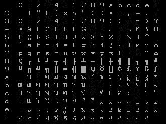

# Thai Easy Writer File Format

This program use KU (Kaset or เกษตร) for character encoding.

Thai Courier font shipped with Thai Easy Writer 4.1 from Computer Union.

The data format is in fixed length record, using BASIC's text file.

## Control Code

Using `9F` followed by `B` for bold character, `S` for underline character, `Q` for condensed character, `E` for small character and `A` for enlarge character.

| Hex  |            Meaning            |
|:----:|:----------------------------- |
| 9F42 | Toggles bold character        |
| 9F51 | Toggles underline character   |
| 9F53 | Toggles condensed character   |
| 9F45 | Toggles small character       |
| 9F41 | Toggles enlarge character     |

## At Command

This program differ from WordStar with the use of At (@) instead of Dot (.) for command.

|   Command    |                       Meaning                       |
|:-------------|:----------------------------------------------------|
| @CW n        | Character per inch, default 10 : 10, 12, 17         |
| @PL n        | Set paper length in inch, default 11                |
| @PO n        | Set left margin, default 0                          |
| @HE <text>   | Print page header, use `K` to print header at the left in even page, `#` is to print page number |
| @MT n        | Set number of line on page header, default is 1 line (1/3 inch) |
| @HM n        | Set header margin, default 0                        |
| @FO <text>   | Print page footer, use `K` to print footer at the left in even page, `#` is to print page number |
| @MB n        | Set number of line on page footer, default is 2 line (2/3 inch) |
| @FM n        | Set footer margin, default 0                        |
| @OP          | Omit page number                                    |
| @PN n        | Set starting page number, default 1                 |
| @PC n        | Set page number position, default 37                |
| @PA          | Page break                                          |
| @CP n        | Conditional page break, `n` is line that will be print in the same page |
| @IG          | Comment, not print this line                        |
| @@           | Comment, not print this line                        |

Mail merge command

|   Command    |                       Meaning                       |
|:-------------|:----------------------------------------------------|
| @DF          | Open `.THI` file contain name list in `file` for mailmerge, don't have to enter file extension |
| @RV          | Read variable from `@DF` file for mailmerge         |
| @RP          | Read the variable until end of file                 |
| @AV "text",var | Set variable `var` using input from keyboard, `text` is displayed text on the screen |
| @SV var,name | Set variable, `var` is variable name, `text` is text name |
| @CS          | Clear screen for display text from `@DM` or `@AV`   |
| @DM <text>   | Display message                                     |

## Reference
* ห้องปฏิบัติการวิจัยไมโครฯ มหาวิทยาลังเกษตรฯ, *ขวัญใจนักพิมพ์ดีด เวอร์ชัน 4.10*, ไมโครคอมพิวเตอร์, 19 (2529), หน้า 86 - 88.
* ประภาส จงสถิตย์วัฒนา, *โปรแกรมลดขนาดแฟ้มขวัญใจนักพิมพ์ดีดได้ 5 เท่า*, ไมโครคอมพิวเตอร์, 34 (2530), หน้า 212 - 217.
