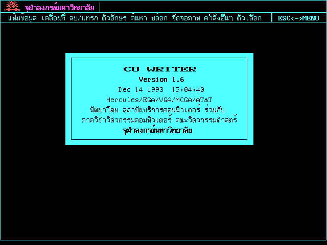
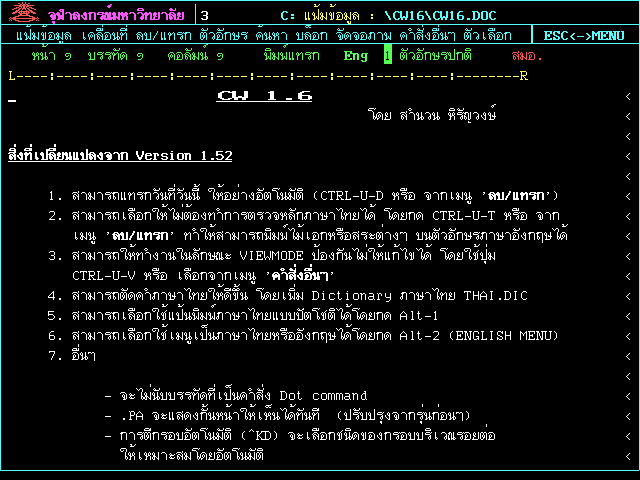
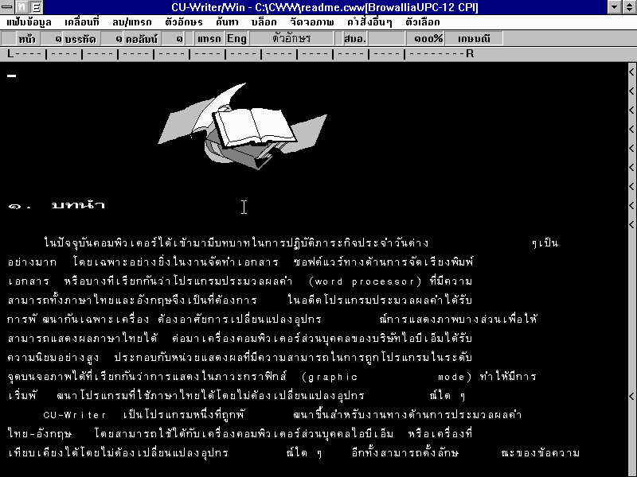

# CU Writer

หน้าจอแสดงรุ่นโปรแกรม

พื้นที่ทำงานเอกสารบนซียูไรเตอร์

## เกี่ยวกับ CU Writer (ซียูไรเตอร์ )

ซียูไรเตอร์ (CU Writer) หรือเรียกอย่างไม่เป็นทางการว่า จุฬาเวิร์ด, เวิร์ดจุฬา หรือ CW เป็นโปรแกรมประมวลคำภาษาไทย ทำงานบนระบบปฏิบัติการดอส สร้างขึ้นโดยความร่วมมือจาก สถาบันบริการคอมพิวเตอร์ กับภาควิชาวิศวกรรมคอมพิวเตอร์ คณะวิศวกรรมศาสตร์ จุฬาลงกรณ์มหาวิทยาลัย นำโดยนายสำนวน หิรัญวงษ์ เมื่อต้นปี พ.ศ. 2532 พัฒนาอย่างต่อเนื่องจนถึง พ.ศ. 2536 จึงยุติการพัฒนา รุ่นล่าสุดอยู่ที่รุ่น 1.6

## ประวัติ

ซียูไรเตอร์ พัฒนาขึ้นโดยสถาบันบริการคอมพิวเตอร์ ร่วมกับภาควิชาวิศวกรรมคอมพิวเตอร์ คณะวิศวกรรมศาสตร์ จุฬาลงกรณ์มหาวิทยาลัย ในปี พ.ศ. 2530 โดยโครงการนี้คาดหวังว่าจะใช้เป็นโปรแกรมสำหรับสร้าง และแก้ไขข้อความสำหรับโปรแกรมจัดการไปรษณีย์อิเล็กทรอนิกส์ และออกรุ่นทดลองแจกจ่ายให้กับผู้ที่สนใจทดลองใช้ในเดือนกุมภาพันธ์ พ.ศ. 2532 โดยตัวโปรแกรมมีลักษณะการแสดงผลแบบกราฟิก ใช้งานกับเครื่องคอมพิวเตอร์ IBM PC compatible ที่มีการ์ดแสดงผลแบบ Hercules แต่เนื่องจากขณะนั้นเครื่องไมโครคอมพิวเตอร์ส่วนใหญ่เป็นแบบ IBM PC หรือ IBM PC XT จึงทำให้ทำงานได้ช้ากว่าคนป้อนข้อมูล

ต่อมาในเดือนเมษายน พ.ศ. 2532 ได้เผยแพร่รุ่น 1.1 อย่างเป็นทางการ ผ่านทางสถานีโทรทัศน์สีกองทัพบกช่อง 7 โดยประกาศให้เป็นโปรแกรมสาธารณะ และให้บุคคลทั่วไปคัดลอกสำเนาได้โดยไม่เสียค่าใช้จ่ายใดๆ

ในเดือนมิถุนายน พ.ศ. 2532 ได้ออกเผยแพร่รุ่น 1.2 โดยพัฒนาขึ้นให้สามารถใช้งานกับการ์ดแสดงผลแบบ VGA และ EGA ได้

ต่อมาในเดือนกรกฎาคม ได้พัฒนารุ่น 1.2 ให้สามารถใช้กับจอแสดงผลชนิด EDA (จอแสดงผลชนิด EDA ไม่ทราบว่าหมายถึง Enhanced Display Adapter หรือไม่ ในซอร์สโค๊ดของซียูไรเตอร์ 1.41 ถ้าเป็นรุ่น EDA โปรแกรมตรวจสอบพบว่ามีการ์ดแสดงผลแบบ EGA หรือไม่ ถ้ามีจะเปลี่ยนเป็นการแสดงผลของการ์ด Hercules โดยอาจเป็นการ์ดแสดงผล ATi EGA Wonder ที่สามารถต่อกับจอโมโนโครม, จอ CGA และ EGA ได้ ซึ่งโปรแกรมที่ใช้กับการ์ดแสดงผล Hercules ก็สามารถใช้กับการ์ดแสดงผลนี้ได้) ของกระทรวงต่างประเทศที่ใช้อยู่ในเวลานั้นได้ รุ่นนี้ไม่มีเพลงตอนเริ่มโปรแกรม และสามารถใช้กับเครื่องพิมพ์แบบจุด 24 หัวเข็มได้

การพัฒนาต่อมาแบ่งเป็น 2 สายคือ รุ่น 1.21 ออกเผยแพร่ประมาณเดือนสิงหาคม พ.ศ. 2532 โดยรุ่นนี้สามารถบังคับเลือกใช้จอแสดงผลที่ต้องการได้ และสามารถเลือกได้ว่าจะมีเพลงหรือไม่ อีกสายหนึ่งคือ รุ่น 1.3 รุ่นนี้สามารถใช้งานกับการ์ดแสดงผลชนิด MCGA และ ATT400 (การ์ดแสดงผลของ AT&T 6300, Xerox 6060 หรือ Olivetti M24) ได้

จนกระทั่งเดือนพฤศจิกายน พ.ศ. 2532 ได้นำรุ่น 1.21 และ 1.3 มารวมกัน และปรับปรุงโครงสร้างของโปรแกรมให้พัฒนาได้ง่ายขึ้น เป็นรุ่น 1.4 รุ่นทดลอง

รุ่น 1.41 ทดลอง ได้พัฒนาให้สามารถปรับระยะระหว่างบรรทัดขณะพิมพ์ ให้เหมาะกับจำนวนบรรทัดต่อหน้าได้

ในเดือนมิถุนายน พ.ศ. 2533 ออกเผยแพร่ รุ่น 1.41 โดยแก้ไขข้อบกพร่องในการพิมพ์กับเครื่องพิมพ์ LQ, FX, LX ข้อบกพร่องในการพิมพ์ตาราง และรายละเอียดอื่นๆเล็กน้อย

ต่อมาในวันที่ 21 พฤศจิกายน พ.ศ. 2533 ในงานจุฬาวิชาการ '33 ออกเผยแพร่รุ่น 1.5 รุ่นทดลอง เรียกว่ารุ่น "NOVEMBER" ซึ่งพัฒนาให้สามารถแยกพื้นที่การแก้ไขเอกสาร  (ทำงานแบบหน้าต่างหรือช่องแฟ้ม) ได้มากสุดถึง 8 พื้นที่ เพิ่มความสามารถในการคัดลอกส่วนของเอกสารแบบคอลัมน์  และสามารถบันทึกตัวเลือกรวมกับไฟล์เอกสารได้ แต่ยังมีข้อผิดพลาดเกี่ยวกับการพิมพ์บางจุดอยู่

ต่อมาในเดือน ธันวาคม พ.ศ. 2533 ได้ออกเผยแพร่รุ่น 1.5 เรียกว่ารุ่น "DECEMBER" ซึ่งเป็นรุ่นแก้ไขข้อผิดพลาดต่างๆ ของรุ่น 1.5 รุ่นทดลอง "NOVEMBER"

ในวันที่ 11 มีนาคม พ.ศ. 2534 ได้ออกเผยแพร่รุ่น 1.43 รุ่นทดลอง เป็นรุ่นที่ได้พัฒนาต่อจากรุ่น 1.41 โดยพัฒนาให้สามารถแสดงผลภาษาบาลี และภาษาต่างประเทศ เช่น ภาษาสเปน ภาษาฝรั่งเศส และภาษาเยอรมันได้

รุ่น 1.51 เป็นรุ่นแก้ไขข้อผิดพลาดที่ยังมีอยู่ของรุ่น 1.5 ใช้ภายในไม่ได้นำออกเผยแพร่

ต่อมาในวันที่ 13 มิถุนายน พ.ศ. 2534 ออกเผยแพร่รุ่น 1.52 ในงานคอมพิวเตอร์ไทย '91 เป็นรุ่นปรับปรุงจากรุ่น 1.51 เพื่อให้เลือกการใช้งานช่องแฟ้มเดียว หรือหลายช่องแฟ้มได้ และเพิ่มสีให้กับโปรแกรม เรียกว่ารุ่น "JUN 10"

ต่อมาไม่นานในวันที่ 18 กรกฎาคม พ.ศ. 2534 ได้นำรุ่น 1.52 ซึ่งเป็นรุ่นที่ปรับปรุงจากรุ่น  "JUN 10" ออกเผยแพร่ในงานอิเล็คโทรนิคส์ไทย '91 เรียกว่ารุ่น "JUN 26" โดยปรับปรุงแก้ไขปัญหาเครื่องคอมพิวเตอร์หยุดชงัก (hang) เป็นบางครั้งเมื่อใช้กับจอ VGA โมโนโครม และแก้ไข CUPRINT ให้พิมพ์จดหมายเวียนได้ถูกต้อง

ในปี พ.ศ. 2536 ออกเผยแพร่รุ่น 1.6 ซึ่งพัฒนาต่อจากรุ่น 1.52 โดยเพิ่มความสามารถในการแยกพยางค์ (ตัดคำไทย) โดยใช้พจนานุกรม  สามารถเลือกให้ตัวโปรแกรมไม่ทำการตรวจหลักภาษาไทยได้ รองรับการใช้งานแป้นพิมพ์ปัตตะโชติ เปลี่ยนภาษาของเมนูระหว่างภาษาไทยหรือภาษาอังกฤษได้ เพิ่มแบบอักษรให้เลือกใช้ได้ 4 แบบ และสามารถพิมพ์สมการทางคณิตศาสตร์ได้

ในชุดโปรแกรมยังมี CULASER.EXE, LASER-PRINT รุ่น 1.0 ที่ใช้สำหรับเครื่องพิมพ์ HP LASER compatible

นอกจากนี้ยังมีรุ่นอื่นๆ อีก เช่น ซียูไรเตอร์ฉบับภาษาลาว, ซียูไรเตอร์ซึ่งดัดแปลงสำหรับใช้กับเครื่องคอมพิวเตอร์ NEC PC-9801 โดยนายวิวัฒน์  วงศ์วราวิภัทร์ และ CW สุขุม ที่ดัดแปลงจากรุ่น 1.52 เพื่อเพิ่มการทำงานสำหรับอักษรเบรลล์ เป็นต้น

## จุฬาจารึก

พื้นที่ทำงานเอกสารบนซียูไรเตอร์สำหรับวินโดวส์

 

ไอคอนของ CU Writer และ CU Print for Windows

ในปี พ.ศ.2537 ได้ปรับปรุง CU Writer รุ่น 1.52 ให้สามารถทำงานบน Windows 3.1 ได้ (ทั้งรุ่นภาษาไทย และภาษาอังกฤษ) ภายใต้ชื่อโครงการ "จุฬาจารึก" หรือ CU Writer for Windows 77 (CWW77) ซึ่งได้รับการสนับสนุนจากมูลนิธิปูนซีเมนต์ไทย โดยมีคุณสมบัติเหมือนรุ่น 1.52 ทุกประการ และสามารถใส่รูปภาพไว้ในเอกสารได้ โปรแกรม "จุฬาจารึก" ได้รับรางวัลชมเชยประเภทสิ่งประดิษฐ์ซอฟต์แวร์ของมหาวิทยาลัยจุฬาลงกรณ์ ในปี พ.ศ.2538

ในปี พ.ศ.2540 ได้พัฒนาส่วนเสริมของโปรแกรม Netscape Navigator และ Internet Explorer เพื่อให้สามารถแสดงเอกสารที่สร้างด้วย CU-Writer รุ่น 1.52 และ "จุฬาจารึก" บน World Wide Web ได้

ในปี พ.ศ.2541 มีการพัฒนาเพิ่มความสามารถด้านการรับส่งไปรษณีย์อิเล็คทรอนิกส์ให้กับ "จุฬาจารึก" ทางอินเทอร์เน็ตได้  โดยส่วนของไปรษณีย์อิเล็คทรอนิกส์พัฒนามาจากโปรแกรม Pine รุ่น 3.93 รุ่นล่าสุดคือรุ่น CWW77 E1.2

## รายชื่อผู้พัฒนา

จากเอกสาร และคู่มือที่มาพร้อมกับโปรแกรม CU-Writer รุ่น 1.2 และรหัสต้นฉบับของ CU-Writer รุ่น 1.41

* สถาบันบริการคอมพิวเตอร์ จุฬาลงกรณ์มหาวิทยาลัย และ ภาควิชาวิศวกรรมคอมพิวเตอร์ คณะวิศวกรรมศาสตร์ จุฬาลงกรณ์มหาวิทยาลัย
(Computer Service Centre and Faculty of Engineering, Chulalongkorn University)
* สำนวน หิรัญวงษ์ 
(Sumnuan Hirunwong)
* ไกรศร เลียนษี
(Kraisorn  Liansee)
* ดำเกิง ธรรมเถกิงกิจ
* ทศพล อภิกุลวณิช
(Thotsapol Aphikulvanich)
* ธณัฎฐ์ จิระกาล
(Tanat Chirakarn)
* ประสาท โตปิตุมาตุคุณ
(Prasart Topitumatukhun)
* ลักษณ์ชัย ลือชัยชนะกุล
* วิชัย ปฏิภาภรณ์
(Wichai Patipaporn)
* วิทยา วงศ์อนวัช
(Wittaya Wonganawat)
* สุทธิพงษ์ คนาคกร
(Suttipong Kanakakorn)
* สุบรรณ เย็นใจชน
(Subun Yenjaichon)
* สุวพจน์ จันทโรจนวงศ์

## รายการรุ่น

[รายการรุ่น](https://github.com/kytulendu/CW141/wiki/CU-Writer-Version-Listing)

## รูปแบบไฟล์

[รูปแบบไฟล์](fmt_CU-Writer.md)

## ภาพหน้าจอ

[ภาพหน้าจอของ CU Writer รุ่นต่างๆ](https://github.com/kytulendu/CW141/wiki/Screenshot)

## ลิงค์ดาวน์โหลด

* [CU-Writer collections บน Internet Archive](https://archive.org/details/cu-writer)
* [ftp://ftp.cs.washington.edu/pub/thaisys/software/dos/cu-writer/](ftp://ftp.cs.washington.edu/pub/thaisys/software/dos/cu-writer/)
* [รหัสต้นฉบับของซียูไรเตอร์ รุ่น 1.41 บน GitHub](https://github.com/kytulendu/CW141)
* [Khralkatorrix's Thai Software Archive](https://mega.nz/folder/n9MDlbhB#33wlBLjLgh_tTo7NVkcxRQ) ใน `PC/Office/CU-Writer`

## คู่มือ

[รายการคู่มือ](https://github.com/kytulendu/CW141/wiki/CU-Writer-Manual)

## อ้างอิง

### หนังสือ

* เดือน สินธุพันธ์ประทุม และสำนวน หิรัญวงษ์. CU Writer : ศึกษาด้วยตนเอง เวอร์ชัน 1.52 และ 1.6. พิมพ์ครั้งที่ 2. กรุงเทพฯ : โรงพิมพ์จุฬาลงกรณ์มหาวิทยาลัย, 2536.
* บุญเรือน คงเขียว. คู่มือการใช้งาน CU Writer เวอร์ชั่น 1.52 และ 1.6. ซีเอ็ดยูเคชั่น, 2537. ISBN 974-510-276-8.
* วันเพ็ญ ขจรกลิ่น. CU-Writer และโปรแกรมจัดทำเอกสารแบบครบวงจร. พิมพ์ครั้งที่ 1. กรุงเทพฯ : เวฟพอยท์, 2536. ISBN/ISSN 974-704-556-7.
* บริษัท เวฟพอยท์ จำกัด. CU-Writer และจุฬาจารึก. กรุงเทพฯ : เวฟพอยท์, 2538. ISBN/ISSN 974-893-922-7.

### บทความ

* สำนวน หิรัญวงษ์. (2534). CU WRITER กว่าจะเป็นเวอร์ชั่น 1.5. คอมพิวเตอร์ บิซิเนส แมกะซีน, (23), 194-198.
* บุญเรือน คงเขียว. (2534). CU WRITER เวอร์ชั่นพิเศษ 1.43 สำหรับภาษาต่างประเทศ. คอมพิวเตอร์ บิซิเนสแมกะซีน, (28), 195-199.
* ชูเกียรติ นาคพิทักษ์กุล. (2534). CU WRITER 1.52 เผ็ดจริงนะตัวแค่เนี้ย. คอมพิวเตอร์รีวิว, (84), 220-226.
* บุญเรือน คงเขียว. (2534). อะไรเพิ่มใหม่ใน CU WRITE 1.52. คอมพิวเตอร์ บิซีเนสแมกะซีน, (31), 139-143.
* กองบรรณาธิการ. (2536). ทดสอบ 6 เวิร์ดโปรเซสเซอร์ไทย. ไมโครคอมพิวเตอร์, (90), 200-206.
* สมชาติ รุ่งเรืองสรการ. (2536). *วิเคราะห์โครงสร้าง RW และ CW Laser Font. ไมโครคอมพิวเตอร์, (98), 271-278.
* บุญเรือน คงเขียว. (2537). ใหม่ล่าสุด CU WRTIER เวอร์ชั่น 1.6. ไมโครคอมพิวเตอร์, (xx), 305-313.
* บุญเรือน คงเขียว. (2537). CU-Writer เวอร์ชั่น 1.6 ล่าสุดของเวิร์ดจุฬาฯ. คอมพิวเตอร์ บิซีเนสแมกะซีน, (59), 101-104.
* สำนวน หิรัญวงษ์. (2537). 6 ปี CU-WRITER. คอมพิวเตอร์บิซิเนส แมกะซีน, (64), 122-128.
* ดุสิต เลาหสินณรงค์. (2537). CU WRITER ฉบับภาษาลาว. คอมพิวเตอร์ทูเดย์, (38), 125-127.
* ดุสิต เลาหสินณรงค์. (2537). เทคนิคพิเศษในการใช้งาน CU - WRITER. คอมพิวเตอร์ทูเดย์, (40), 61-64.
* ไม่ปรากฏชื่อผู้แต่ง. (2538). จุฬาจารึก CW บนวินโดว์ส. คอมพิวเตอร์บิซิเนส แมกะซีน, (73), 197-200.
* [CU-Writer](http://www.cp.eng.chula.ac.th/~pizzanu/temp/cuwriter.pdf)

### อื่นๆ

* [เอกสาร และคู่มือที่มาพร้อมกับโปรแกรม CU-Writer](https://archive.org/details/cu-writer) (ใน CWDOC)

_เนื้อหาบางส่วนนำมาจาก [วิกิพีเดีย](https://th.wikipedia.org/wiki/%E0%B8%8B%E0%B8%B5%E0%B8%A2%E0%B8%B9%E0%B9%84%E0%B8%A3%E0%B9%80%E0%B8%95%E0%B8%AD%E0%B8%A3%E0%B9%8C)_
