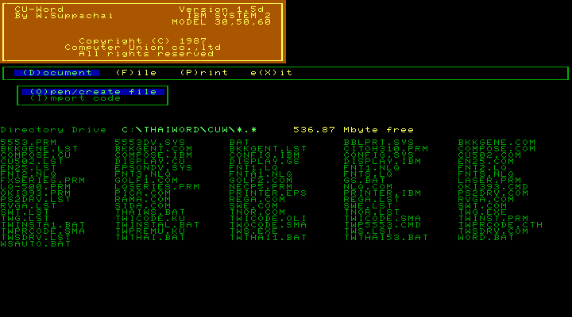
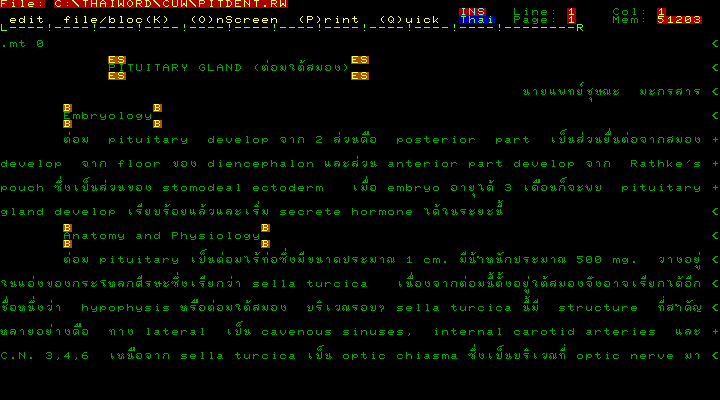

# Computer Union Word

Computer Union Word 1.5d Main Menu

Computer Union Word 1.5d Document Editor

Computer Union Word is a Thai/English word processor from Computer Union Co., Ltd.

Contain Gold Star and IBM PS/2 Model 30, 50, 60 version.
Also include Computer Union Thai Driver for IBM PS2 (`PS2DRV.COM`).

Gold Star version, run `GS.BAT` or `THAIWS.BAT`.

IBM PS/2 version, run `WORD.BAT`.

The program use Grave Accent (`) key to toggle Thai/English input language.
