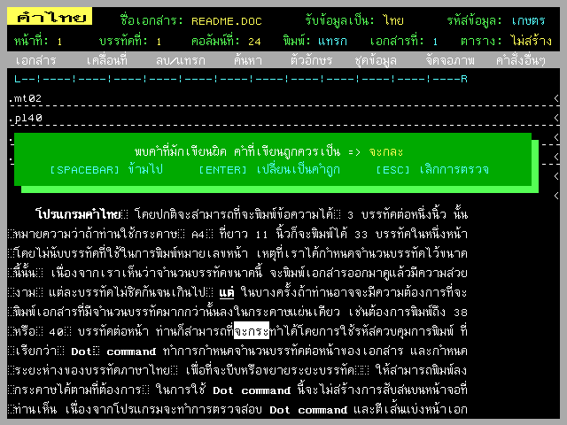

# Khum Thai (คำไทย) Word Processor

Khum Thai Word Processor Editor

Khum Thai Word Processor Spell Checking

Khum Thai (คำไทย) is a Thai/English word processor from Opus Ltd.

This software have Thai/English spell checking functionary with 20,000 Thai words and 100,000 English words, and can insert soft-space in document for use with PageMaker or other Desktop Publishing software.
