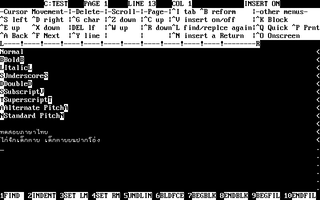

# Loxley Thai Word Processor 4.0

Loxley Thai Word Processor 4.0 Editor

Loxley Thai Word Processor is a Thai WordStar clone, bundled with Olivetti M24 computers that distributed by Loxley Co.,Ltd.

The software use AT&T 400 graphic mode (640x400) to display Thai language. It can run on DOSBox with svga_s3 video card emulation.

To switch Thai/English input, press Scroll Lock key.

The software use Loxley Thai character encoding, document can be convert to/from TIS-620 or Loxey character encoding using the included `CP.COM` TSR (use Ctrl+Left Shift key) or Thai System Manager (TSM) File Converter Utility.

Information on Loxley Thai character encoding:
https://github.com/kytulendu/libwordthai/blob/master/doc/code_other.md#loxley

Loxley Thai Word Processor file format:
https://github.com/kytulendu/libwordthai/blob/master/doc/fmt_Loxley_Thai_Word_Processor.md
