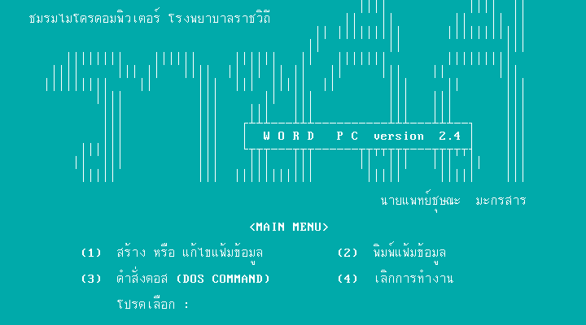
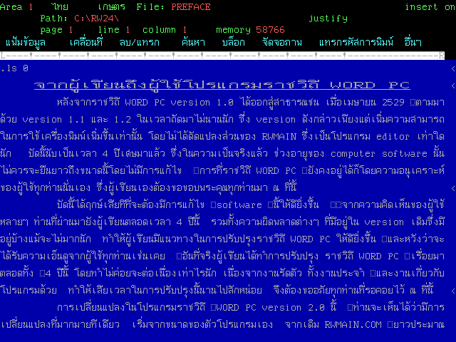
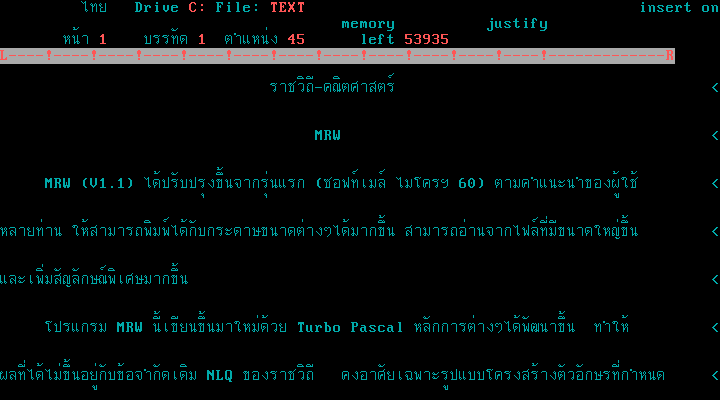

# ราชวิถีเวิร์ดพีซี (Rajavithi Word PC)

หน้าจอเมนูราชวิถีเวิร์ดพีซี

พื้นที่ทำงานเอกสารบนราชวิถีเวิร์ดพีซี 2.4

พื้นที่ทำงานเอกสารบนราชวิถีเวิร์ดพีซี 1.1

## เกี่ยวกับ ราชวิถีเวิร์ดพีซี (Rajavithi Word PC)

ราชวิถีเวิร์ดพีซี (Rajavithi Word PC) หรือเรียกอย่างไม่เป็นทางการว่า ราชวิถีเวิร์ดพีซี, เวิร์ดราชวิถี หรือ RW เป็นโปรแกรมประมวลคำ ทำงานบนระบบปฏิบัติการเอ็มเอสดอส สร้างขึ้นโดยชมรมไมโครคอมพิวเตอร์ โรงพยาบาลราชวิถี นำโดยนายแพทย์ชุษณะ มะกรสาร เมื่อ พ.ศ. 2526 พัฒนาอย่างต่อเนื่องจนถึง พ.ศ. 2536 รุ่นล่าสุดอยู่ที่รุ่น 2.4 โปรแกรมนี้มีการนำมาใช้สอนเป็นหลักสูตรวิชาคอมพิวเตอร์เบื้องต้นในสถานศึกษา

## ประวัติ

ราชวิถีเวิร์ดพีซี พัฒนาขึ้นโดยชมรมไมโครคอมพิวเตอร์ โรงพยาบาลราชวิถี นำโดยนายแพทย์ชุษณะ มะกรสาร เมื่อ พ.ศ. 2526 และออกเผยแพร่สู่ผู้ใช้ครั้งแรก เมื่อ เมษายน พ.ศ. 2529 และได้มี รุ่น 1.1 และ 1.2 ออกมาในเวลาถัดมาไม่นาน ซึ่งรุ่น 1.1 และ 1.2 เพิ่มขีดความสามารถในการพิมพ์ แต่ไม่มีการแก้ไขในส่วนของโปรแกรมแก้ไขข้อความแต่อย่างใด
ราชวิถีเวิร์ดพีซี รุ่น 1.x สามารถใช้กับการ์ดแสดงผลแบบโมโนโครมที่ดัดแปลงใส่รอมอักขระภาษาไทยลงไป หรือการ์ดภาษาไทย เท่านั้น

รุ่น 2.0 พัฒนาขึ้นให้สามารถใช้กับการ์ดแสดงผลแบบ VGA และ EGA ในภาวะข้อความ และการ์ดแสดงผลแบบ Hercules ในภาวะกราฟิก ได้เพิ่มความสามารถในการพิมพ์ ซึ่งได้นำออกเผยแพร่เมื่อ ตุลาคม พ.ศ. 2533

รุ่น 2.1 พัฒนาให้สามารถแสดงผลในภาวะกราฟิกกับการ์ดแสดงผลแบบ VGA และ EGA ได้ ออกเผยแพร่เมื่อ 15 กันยายน พ.ศ. 2534

รุ่น 2.2 เป็นรุ่นสำหรับใช้ภายใน ไม่ได้ออกเผยแพร่

รุ่น 2.3 พัฒนาให้สามารถแสดงสีในภาวะกราฟิก เมื่อใช้กับการ์ดแสดงผลแบบ VGA ได้ สามารถเปิดแฟ้มข้อมูลได้ครั้งละ 2 แฟ้มข้อมูล และสามารถสร้างไฟล์สำรอง ซึ่งมีนามสกุล .bak โดยอัตโนมัติเมื่อทำการบันทึก โดยรุ่นนี้มีเมนูแบบพูลดาวน์ เพื่อความสะดวกของผู้เริ่มใช้โปรแกรม  นำออกเผยแพร่เมื่อ 2 สิงหาคม พ.ศ. 2535

นอกจากนี้ยังมีรุ่นอื่นๆ อีก เช่น ราชวิถี PLOT PC ดัดแปลงให้สามารถพิมพ์เอกสารโดยใช้เครื่องพล็อตเตอร์ (Plotter), ราชวิถีเลเซอร์ ดัดแปลงให้สามารถพิมพ์ออกเครื่องพิมพ์เลเซอร์, MRW และ MRW (LASER) ดัดแปลงให้สามารถพิมพ์สูตรคณิตศาสตร์ได้

## ข้อจำกัด

ราชวิถีเวิร์ดพีซีมีข้อจำกัดในด้านขนาดไฟล์เอกสาร ที่มีความยาวได้ไม่เกิน 64 กิโลไบต์

## ความต้องการของระบบ

* ไมโครคอมพิวเตอร์ 16 บิต แบบ IBM PC compatible
* หน่วยความจำอย่างน้อย 256 กิโลไบต์
* การ์ดแสดงผลภาษาไทย (การ์ดภาษาไทย) หรือ การ์ดแสดงผลแบบ Hercules, EGA และ VGA
* เครื่องขับแผ่นบันทึกแบบอ่อนอย่างน้อย 1 ตัว
* เครื่องพิมพ์
* จอภาพแบบสีหรือแบบโมโนโครม

## รูปแบบไฟล์

[รูปแบบไฟล์](fmt_Rajavithi_Word_PC.md)

## ลิงค์ดาวน์โหลด

- [Rajavithi Word PC collections บน Internet Archive](https://archive.org/details/rajavithi-word-pc)
- [Khralkatorrix's Thai Software Archive](https://mega.nz/folder/n9MDlbhB#33wlBLjLgh_tTo7NVkcxRQ) ใน `PC/Office/Rajavithi Word PC`

## คู่มือ

- [ราชวิถี เวิร์ด พีซี 2.1](https://archive.org/details/rajavithi-word-pc-2.1-manual)
- [คู่มือโปรแกรมราชวิถี Word PC 2.3](https://archive.org/details/rajavithi-word-pc-2.3-manual)

## อ้างอิง

### หนังสือ

* ชุษณะ มะกรสาร, สมชาย รงค์กรรภิรมย์ และสุรพล เจริญรัตนวงศ์. *ราชวิถี WORD PC Version 2.0*. พิมพ์ครั้งที่ 1, กรุงเทพฯ : ซีเอ็ดยูเคชั่น, 2534. ISBN/ISSN 974-509-226-6.
* ชุษณะ มะกรสาร, สมชาย รงค์กรรภิรมย์ และสุรพล เจริญรัตนวงศ์. *ราชวิถี Word PC version 2.1*. พิมพ์ครั้งที่ 1, กรุงเทพฯ : ซีเอ็ดยูเคชั่น, 2534. ISBN/ISSN 974-509-227-4.
* ชัยรัตน์ เจน. *ราชวิถีเวิร์ด พีซี เวอร์ชั่น 2.1*. ม.ป.ท.: ม.ป.พ., 2535.
* เกษมชาติ ทองชา. *คู่มือเรียน : ราชวิถีเวิร์ดพีซี เวอร์ชั่น 2.3*. พิมพ์ครั้งที่ 1, กรุงเทพฯ : ซีเอ็ดยูเคชั่น, 2538. ISBN/ISSN 974-512-475-3.
* สมชาย รงค์กรรภิรมย์. *คู่มือการใช้โปรแกรมราชวิถี WORD PC และ ราชวิถี PLOT PC*. กรุงเทพฯ : คอมพิวเตอร์บิสิเนส, 2531. ISBN/ISSN 974-867-324-3.
* สิทธิชัย ประสามวงศ์, *เทคนิคการใช้เครื่อง IBM PC/XT*. ศูนย์อบรมคอมพิวเตอร์ธุรกิจ, 2528. 
* สิทธิชัย ประสานวงศ์. *คู่มือการใช้ DOS และโปรแกรมสำเร็จรูป*. ศูนย์อบรมคอมพิวเตอร์ธุรกิจ, 25XX.
* ชัยวุฒิ จันมา, บัณฑิต ผลประสิทธิ์, ปราศรัย ประวัติรุ่งเรือง. *การใช้ราชวิถีเวิร์ดพีซี*. พิมพ์ครั้งที่ 1, กรุงเทพฯ : สยามคอมพิวเตอร์, 2532. ISBN/ISSN 974-855-537-2.

### บทความ

* ประพัฒน์ อุทโยภาศ. (2530). *ราชวิถี PLOT*. ไมโครคอมพิวเตอร์, (29), 86-88.
* เมษ พงษ์อำไพ. (2532). *เวิร์ดราชวิถีขยายตัว*. ไมโครคอมพิวเตอร์, (51), 300-302.
* อาจหาญ สัตยารักษ์. (2532). *การทำอักขระกราฟิกด้วย WORD PC*. ไมโครคอมพิวเตอร์, (52), 279-285.
* ปฐมพงศ์ ปัญญาวิวานนท์. (2532). *การแปลงไฟล์จากโปรแกรม CU-WRITER ไปใช้ในเวิร์ดราชวิถี*. ไมโครคอมพิวเตอร์, (53), 291-294.
* เมษ พงษ์อำไพ. (2532). *พิมพ์ BIGFONT ด้วยเวิร์ดราชวิถี*. ไมโครคอมพิวเตอร์, (54), 281-283.
* สมชาติ รุ่งเรืองสรการ. (2533). *โปรแกรมช่วยราชวิถีพิมพ์อักษรคณิตศาสตร์ (MRW)*. ไมโครคอมพิวเตอร์, 60, 273-278.
* บุญเรือน คงเขียว. (2534). *มีอะไรใหม่ในเวิร์ดราชวิถี 2.0 (1)*. ไมโครคอมพิวเตอร์, (70), 295-301.
* บุญเรือน คงเขียว. (2534). *มีอะไรใหม่ในเวิร์ดราชวิถี 2.0 (จบ)*. ไมโครคอมพิวเตอร์, (71), 327-332.
* บุญเรือน คงเขียว. (2534). *พัฒนาการตามคำเรียกร้อง ราชวิถีเลเซอร์*. ไมโครคอมพิวเตอร์, (74), 310-316.
* บุญเรือน คงเขียว. (2534). *เทคนิคและคำสั่งใหม่ในราชวิถี 2.0*. ไมโครคอมพิวเตอร์, (75), 320-325.
* สมชาติ รุ่งเรืองสรการ. (2535). *แนะนำ MRW(LASER)*. ไมโครคอมพิวเตอร์, (77), 323-325.
* บุญเรือน คงเขียว. (2535). *มีอะไรใหม่ในราชวิถี 2.1*. ไมโครคอมพิวเตอร์, (78), 289-290.
* บุญเรือน คงเขียว. (2535). *DOT RUN กับงานพิมพ์ในราชวิถี 2.0*. ไมโครคอมพิวเตอร์, (79), 263-276.
* กองบรรณาธิการ. (2536). *ทดสอบ 6 เวิร์ดโปรเซสเซอร์ไทย*. ไมโครคอมพิวเตอร์, (90), 200-206.
* สมชาติ รุ่งเรืองสรการ. (2536). *วิเคราะห์โครงสร้าง RW และ CW Laser Font*. ไมโครคอมพิวเตอร์, (98), 271-278.
* สัมฤทธิ์ แสนธิ. (2537). *เวิร์ดราชวิถี 2.3 เวิร์ดโปรเซสเซอร์สำหรับคนไทย*. ไมโครคอมพิวเตอร์, (102), 306-312.
* สมชาย ศิริเจริญไทย. (2537). *สร้างตารางแบบใหม่ในเวิร์ดราชวิถี*. ไมโครคอมพิวเตอร์, (106), 276-279.

### อื่นๆ

* เอกสารคู่มือ PREFACE และ README.FST ซึ่งมาพร้อมกับโปรแกรมราชวิถีเวิร์ดพีซี (สาธารณสมบัติ)

_เนื้อหาบางส่วนนำมาจาก [วิกิพีเดีย](https://th.wikipedia.org/wiki/%E0%B8%A3%E0%B8%B2%E0%B8%8A%E0%B8%A7%E0%B8%B4%E0%B8%96%E0%B8%B5%E0%B9%80%E0%B8%A7%E0%B8%B4%E0%B8%A3%E0%B9%8C%E0%B8%94%E0%B8%9E%E0%B8%B5%E0%B8%8B%E0%B8%B5)_
