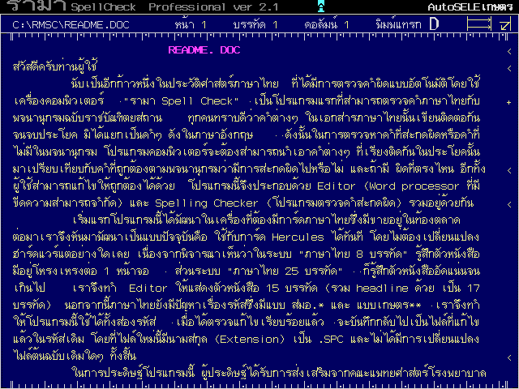

# Rama SpellCheck

พื้นที่ทำงานเอกสารบนรามา สเปลล์เช็ก

## เกี่ยวกับ รามา สเปลล์เช็ก (Rama SpellCheck)

รามา สเปลล์เช็ก (Rama SpellCheck) หรือเรียกอย่างไม่เป็นทางการว่า เวิร์ดรามา เป็นโปรแกรมประมวลคำ ทำงานบนเอ็มเอสดอส สร้างขึ้นโดยชมรมไมโครคอมพิวเตอร์โรงพยาบาลรามาธิบดี นำโดยนายแพทย์ทวีศักดิ์ จันทร์วิทยานุชิต

## ประวัติ

รามา สเปลล์เช็ก พัฒนาโดยนายแพทย์ทวีศักดิ์ จันทร์วิทยานุชิต เมื่อ พ.ศ. 2528 โดยเริ่มพัฒนาให้ใช้งานกับเครื่องไมโครคอมพิวเตอร์แอปเปิล II แต่ในขณะนั้น ความนิยมใช้เครื่องไมโครคอมพิวเตอร์แอปเปิล II เริ่มเสื่อมลง จึงได้หยุดการพัฒนาไว้ชั่วคราว

ต่อมาในปี พ.ศ. 2532 นายแพทย์ทวีศักดิ์ฯ ได้เริ่มเขียนโปรแกรมตรวจคำสะกดภาษาไทยบนเครื่องไมโครคอมพิวเตอร์  IBM PC แต่ยังขาดส่วนของโปรแกรมแก้ไขข้อความอยู่ จึงได้นำโปรแกรม เวิร์ดรามา (WordRama) สำหรับเครื่อง IBM PC ของชมรมไมโครคอมพิวเตอร์โรงพยาบาลรามาธิบดี ซึ่งยังไม่เคยออกแผยแพร่ นำมาตัดความสามารถบางส่วนออก และเพิ่มความสามารถในการตรวจคำสะกดภาษาไทย โดยคาดหวังว่าจะพัฒนาเสร็จสิ้น และนำออกแสดงในงานฉลองครบรอบ 20 ปี โรงพยาบาลรามาธิบดี ในเดือนพฤษภาคม พ.ศ. 2532 แต่ไม่สามารถพัฒนาเสร็จได้ทันเวลา

ต่อมาในเดือนกรกฎาคม พ.ศ. 2532 ได้ออกรุ่นสดสอบ โดยสามารถใช้งานได้กับการ์ดแสดงผลแบบโมโนโครมที่ดัดแปลงใส่รอมอักขระภาษาไทยลงไป  หรือการ์ดภาษาไทย แสดงผลภาษาไทยได้ 7 บรรทัด ในภาวะข้อความ  ในช่วงเดียวกันนี้ ทางมหาวิทยาลัยจุฬาลงกรณ์ ได้เผยแพร่โปรแกรมประมวลผลคำ ซียูไรเตอร์ โดยโปรแกรมนี้มีการแสดงผลในภาวะกราฟิก ซึ่งมีข้อดีคือไม่ต้องใช้การ์ดภาษาไทยในการแสดงผล  ในเดือนกันยายน พ.ศ. 2532  นายแพทย์ทวีศักดิ์ฯได้ชวน นายดาวุด  สุมานะนันท์ เข้ามาช่วยพัฒนาให้โปรแกรม รามา สเปลล์เช็ก ให้สามารถแสดงผลในภาวะกราฟิกบนการ์ดแสดงผลแบบ Hercules โดยพัฒนาเสร็จในเดือนพฤษจิกายน พ.ศ. 2532

ในเดือนมกราคม พ.ศ. 2533 ได้พัฒนาให้สามารถแสดงผลในภาวะกราฟิกกับการ์ดแสดงผลแบบ VGA โดยมีนายวิโรจน์  ลาภไพบูลย์พงศ์ เป็นผู้รับอาสาพัฒนา

ต่อมาในเดือนสิงหาคม พ.ศ. 2537 ได้ออกเผยแพร่รุ่น 2.1 (RMSC 2.1) ซึ่งเกิดจากการร่วมมือกันระหว่างนายแพทย์วิโรจน์ ลาภไพบูลย์พงศ์ ผู้พัฒนาส่วนของโปรแกรมแก้ไขข้อความ และอาจารย์ชูเกียรติ แสงมณี ผู้พัฒนาโปรแกรมอลงกต เป็นผู้พัฒนาในส่วนของการพิมพ์

## คุณลักษณะ

* ตรวจคำสะกดภาษาไทยตามพจนานุกรม ฉบับราชบัณฑิตยสถาน พ.ศ. 2525 มีจำนวนคำในพจนานุกรมประมาณ 9,600 คำ
* ตรวจคำสะกดภาษาอังกฤษโดยใช้ร่วมโปรแกรมเทอร์โบ ไลท์นิ่ง
* ตรวจแฟ้มข้อมูลของโปรแกรมประมวลผลคำภาษาไทยอื่นได้ ทั้งแฟ้มที่ใช้รหัสภาษาไทยแบบ "เกษตร" และรหัส "สมอ." (เทียบเท่า TIS-620)
* สามารถเก็บคำที่ไม่มีในพจนานุกรมหลักไว้ในพจนานุกรมส่วนตัว
* มีส่วนของโปรแกรมแก้ไขข้อความ สามารถแก้ไขคำผิดได้ทันที
* ไฟลล์ที่ทำการตรวจคำสะกด จะไม่ถูกเปลี่ยนแปลงแต่อย่างใด โดยจะบันทึกไฟลล์ที่อยู่ในชื่อเดิม แต่มีนามสกุลเป็น .SPC
* สามารถแยกเก็บพารามิเตอร์ที่อยู่ท้ายแฟ้มข้อมูล และเขียนกลับลงไปหลังจากแก้ไขแฟ้มข้อมูลและทำการบันทึก
* ไม่ต้องใช้การ์ดภาษาไทยหรือไดร์เวอร์ภาษาไทยในการแสดงผล

## อ้างอิง

### หนังสือ
* ทวีศักดิ์  จันทร์วิทยานุชิต. *การตรวจคำสะกดภาษาไทย*. ชมรมไมโครคอมพิวเตอร์โรงพยาบาลรามาธิบดี, 2535. ISBN 974-587-330-6
* Phagos Technology ชมรมไมโครคอมพิวเตอร์ รพ.รามาธิบดี. *คู่มือรามา SpellCheck version 2.1*. พิมพ์ครั้งที่ 1, กรุงเทพฯ : บริษัทพิมพ์สวย จำกัด, 2538.

### บทความ
* บุญเรือน คงเขียว. *รามา SpellCheck เวอร์ชัน 2.1 กำลังออกรุ่นเบต้าอยู่*. คอมพิวเตอร์ บิซิเนส แมกะซีน, 64 (มิ.ย.2537), หน้า 75 - 80
* ชินกรณ์ ตยานุกรณ์. *รามา SpellCheck เวอร์ชั่น 2.1 รามาอวตาร นิยามใหม่ของเวิร์ดไทย ตอน 1*. คอมพิวเตอร์ บิซิเนส แมกะซีน, 64 (ส.ค.2537), หน้า 157 - 166
* ชินกรณ์ ตยานุกรณ์. *รามา SpellCheck เวอร์ชั่น 2.1 รามาอวตาร นิยามใหม่ของเวิร์ดไทย ตอน 2*. คอมพิวเตอร์ บิซิเนส แมกะซีน, 67 (ก.ย.2537), หน้า 107 - 116
* ชินกรณ์ ตยานุกรณ์. *รามา SpellCheck เวอร์ชั่น 2.1 รามาอวตาร นิยามใหม่ของเวิร์ดไทย ตอน 3*. คอมพิวเตอร์ บิซิเนส แมกะซีน, 64 (ต.ค.2537), หน้า 171 - 182
