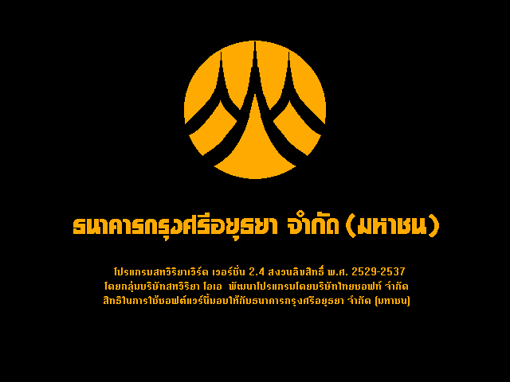
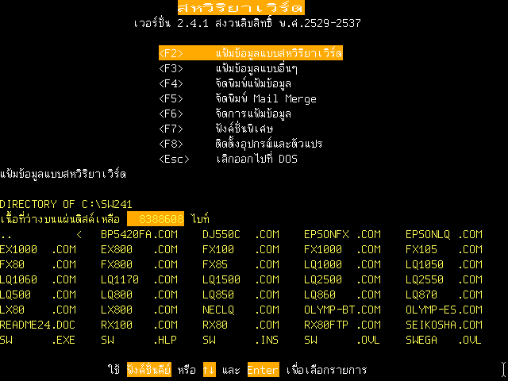
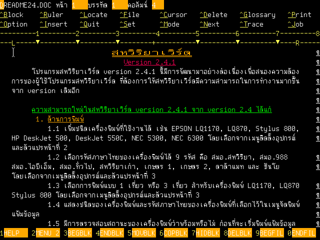

# Sahaviriya Word

Sahaviriya Word 2.4.1 Splash Screen

Sahaviriya Word 2.4.1 Main Menu

Sahaviriya Word Editor

Sahaviriya Word is a Thai/English word processor program running on CP/M and MS-DOS from Sahaviriya OA Co.,Ltd. (now known as SVOA).
First release CP/M version in 1983 (need confirmation), sold with OKI if800 model20, OKI if800 model30 and Epson QX-10 computer that Sahaviriya Infotech Computer (SIC) was the official distributor in Thailand.
Later version are for DOS, first release in 1986. Last DOS version is version 2.4.1 released in 1994.

## Download

* [Sahaviriya Word collections on Internet Archive](https://archive.org/details/sahaviriya-word)
* [Khralkatorrix's Thai Software Archive](https://mega.nz/folder/n9MDlbhB#33wlBLjLgh_tTo7NVkcxRQ) in `PC/Office/Sahaviriya`

## Manual

* บริษัทสหวิริยา โอเอ กรุ๊ป จำกัด. [สหวิริยาเวิร์ด](https://archive.org/details/sahaviriya-word-manual). พิมพ์ครั้งที่ 1, กรุงเทพฯ : สหวิริยา โอเอ กรุ๊ป, 2532. ISBN/ISSN 974-868-837-2.
