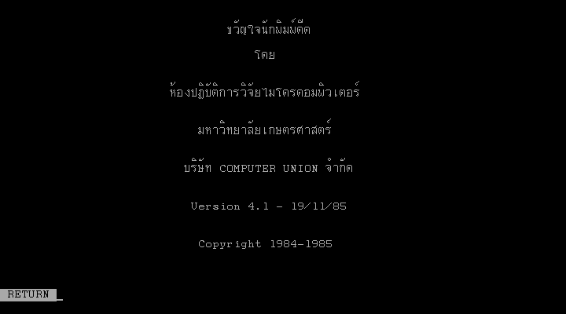
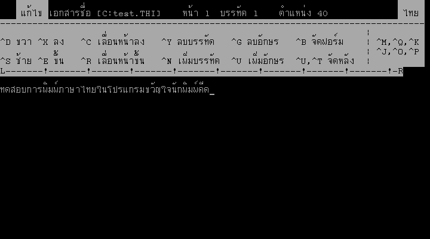

# ขวัญใจนักพิมพ์ดีด (Thai Easy Writer)

หน้าจอเมนูขวัญใจนักพิมพ์ดีด

พื้นที่ทำงานเอกสารบนขวัญใจนักพิมพ์ดีด

## เกี่ยวกับ ขวัญใจนักพิมพ์ดีด (Thai Easy Writer)

โปรแกรม "ขวัญใจนักพิมพ์ดีด" หรือ Thai Easy Writer/Thai Word Processing เป็นโปรแกรมประมวลผลคำภาษาไทยโปรแกรมแรก สร้างขึ้นโดยห้องปฏิบัติการวิจัยไมโครคอมพิวเตอร์ มหาวิทยาลัยเกษตรศาสตร์ นำโดย ยืน ภู่วรวรรณ  เริ่มการพัฒนาบนเครื่องไมโครคอมพิวเตอร์ NEC PC-8001 ด้วยภาษาเบสิก ในปี พ.ศ. 2524 และออกรุ่นแรกสำหรับเครื่องคอมพิวเตอร์ Osborne-1 และ Victor 9000 ในปี พ.ศ. 2525  โปรแกรมนี้ทำงานบนระบบปฏิบัติการ CP/M และ MS-DOS ใช้คำสั่งใกล้เคียงกับโปรแกรม WordStar พัฒนาอย่างต่อเนื่องจนถึง พ.ศ. 2529 จึงยุติการพัฒนา รุ่นล่าสุดอยู่ที่รุ่น 4.2

เนื่องจากโปรแกรมนี้เขียนด้วยภาษา BASIC จึงทำให้สามารถทำการพอร์ทไปยังคอมพิวเตอร์รุ่นต่างๆ ได้ง่าย  โดยรุ่น 4.x สำหรับไมโครคอมพิวเตอร์รุ่นเทียบเท่า IBM PC ได้รับการพอร์ทไปยังคอมพิวเตอร์รุ่นต่างๆ ดังนี้

* Victor 9000/ACT Sirius 1
* ACT Apricot
* NEC APC
* NEC APC III
* Texas Instruments Professional Computer
* Olympia People
* IBM PC (จัดจำหน่ายโดย Computer Union)
* Uniwell (จัดจำหน่ายโดย ไทยวาสโก)
* TAVON PC (ไมโครคอมพิวเตอร์รุ่นเทียบเท่า IBM PC ของไทย)
* Columbia Data Products MPC 1600
* TeleVideo TS 1603

โปรแกรมนี้ใช้รหัสภาษาไทยแบบเกษตร ซึ่งเป็นรหัสภาษาไทยที่ใช้ในห้องปฏิบัติการวิจัยไมโครคอมพิวเตอร์ มหาวิทยาลังเกษตรศาสตร์ และใช้กันอย่างแพร่หลายก่อนที่จะมีมาตรฐานรหัสภาษาไทยแบบ สมอ. (TIS-620)

## รูปแบบไฟล์

[รูปแบบไฟล์](fmt_ThaiEasy_Writer.md)

## ลิงค์ดาวน์โหลด

* [Thai Easy Writer 4.1 (1985) บน Internet Archive](https://archive.org/details/thai-easy-writer-4.1/)
* [Thai Easy Writer 4.2 (1986) บน Internet Archive](https://archive.org/details/thai-easy-writer-4.2/)
* [Thai Easy Writer 4.2 บน Vetusware](https://vetusware.com/download/Thai%20Easy%20Writer%204.2%20TH/?id=18067)
* [Khralkatorrix's Thai Software Archive](https://mega.nz/folder/n9MDlbhB#33wlBLjLgh_tTo7NVkcxRQ) ใน `PC/Office/Thai Easy Writer`

## คู่มือ

* [เวิร์ดโปรเซสซิ่ง](https://archive.org/details/wordprocessing_1989)

## อ้างอิง

### หนังสือ

* ยืน ภู่วรวรรณ และพิชิต สุขเจริญพงษ์. เวิร์ดโปรเซสซิ่ง. กรุงเทพฯ : ซีเอ็ดยูเคชั่น, 2528. ISBN 974-509-214-2.
* ยืน ภู่วรวรรณ. เรื่องน่ารู้เกี่ยวกับไมโครคอมพิวเตอร์. กรุงเทพฯ : ซีเอ็ดยูเคชั่น, 2527. ISBN 974-796-428-3.

### บทความ

* กองบรรณาธิการ. (2525). ข่าว : Thai word processing จากห้องปฏิบัติการวิจัยไมโครคอมพิวเตอร์ เกษตร. เซมิคอนดักเตอร์ อิเล็คทรอนิกส์, (53), 71-72.
* กองบรรณาธิการ. (2526). ข่าว : ไมโครคอมพิวเตอร์ภาษาไทย. เซมิคอนดักเตอร์ อิเล็คทรอนิกส์, (57), 98-99.
* ห้องปฏิบัติการวิจัยไมโครฯ มหาวิทยาลังเกษตรฯ. (2528). ขวัญใจนักพิมพ์ดีด. ไมโครคอมพิวเตอร์, (14).
* ห้องปฏิบัติการวิจัยไมโครฯ มหาวิทยาลังเกษตรฯ. (2529). ขวัญใจนักพิมพ์ดีด เวอร์ชัน 4.10. ไมโครคอมพิวเตอร์, (19), 86-88.
* ประภาส จงสถิตย์วัฒนา. (2530). โปรแกรมลดขนาดแฟ้มขวัญใจนักพิมพ์ดีดได้ 5 เท่า. ไมโครคอมพิวเตอร์, (34), 212-217.
* Thaweesak Koanantakool. (1997). [Multilingual Information Technology Initiatives in Thailand](https://www.nectec.or.th/it-standards/mlit97/keynote.html). Retrieved 30 March 2025, from https://www.nectec.or.th/it-standards/mlit97/keynote.html
