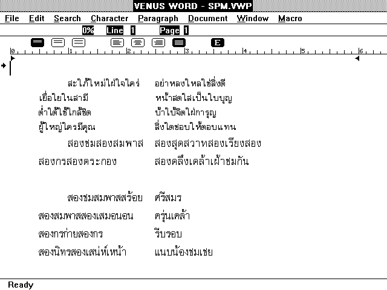

# VENUS Word Processor

VENUS Word 1.0 Editor

Thai WYSIWYG Word Processor from mysterious developer, release in 1991.

The software is develop using Turbo Pascal 6.0 and Metagraphics MetaWINDOW/Plus 3.0E.

Originally release on BBS, this copy is from ftp.cs.washington.edu/pub/thaisys/BBS/venus.zip

This program support reading CU Writer 1.5x or older documents.

F10 -> Menu
Grave Accent (`) -> Toggle Thai/English input language
