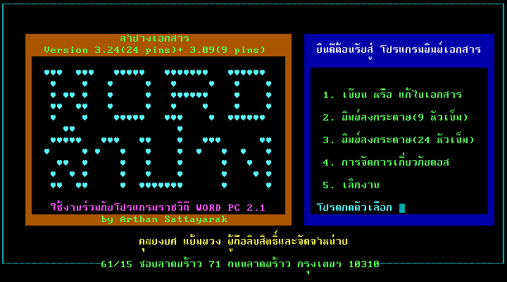

# Word Lampang (เวิร์ดลำปาง) (ลำปางเอกสาร)

Word Lampang Main Menu

Word Lampang or เวิร์ดลำปาง or ลำปางเอกสาร is a document printer for Rajavithi Word PC, develop by Arthan Sattayarak (อาจหาญ สัตยารักษ์) and distributed by Yongyos Yampuang (ยงยศ แย้มพวง) as mail order for 250 THB (include manual).

This software use Rajavithi Word PC 2.1 as document editor and have custom document printer. The document printer program support 6 different fonts and can print 2-3 times enlarge characters.
