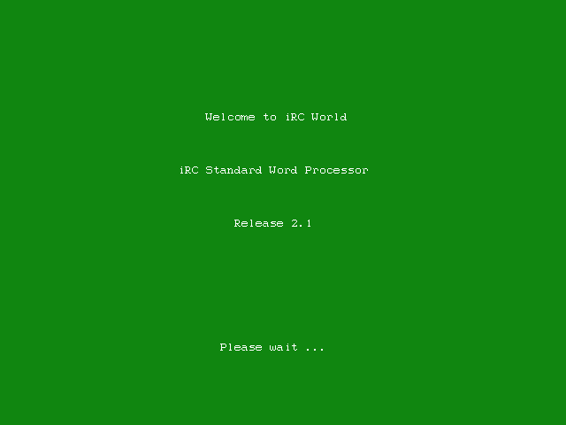
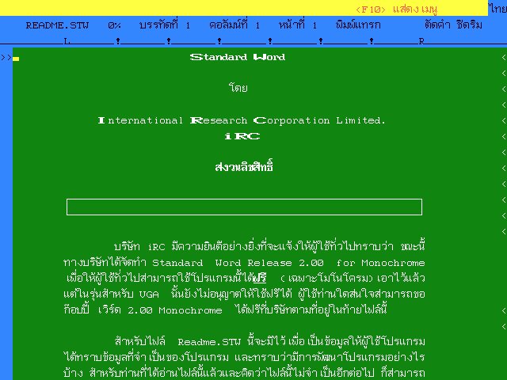

# iRC Standard Word

iRC Standard Word is a Thai/English word processor program running on MS-DOS from International Research Corporation Co.,Ltd.

iRC Standard Word along with Rama SpellCheck is one of the few Thai word processor software on DOS that have Thai spell checking functionary.

## Download

* [iRC Standard Word collections on Internet Archive](https://archive.org/details/irc-standard-word) iRC Standard Word Processor 1.75b1 (Hercules version) and iRC Standard Word Processor 2.1 (VGA version)
* [Khralkatorrix's Thai Software Archive](https://mega.nz/folder/n9MDlbhB#33wlBLjLgh_tTo7NVkcxRQ) in `PC/Office/iRC/Standard Word`

## Manual

* อินเตอร์เนชันแนล รีเสริช คอร์ปอร์เรชั่น จำกัด. [คู่มือเวิร์ดโปรเซสเซอร์ไทย อังกฤษ Standard Word](https://archive.org/details/irc-standard-word-manual). พิมพ์ครั้งที่ 1. กรุงเทพฯ : อินฟอร์เมติก บิซิเนส พับลิเคชัน จำกัด, 2532.
* อินเตอร์เนชันแนล รีเสริช คอร์ปอร์เรชั่น จำกัด. [คู่มือเวิร์ดโปรเซสเซอร์ไทย อังกฤษ Standard Word Release 2](https://archive.org/details/irc-standard-word-release-2-manual). พิมพ์ครั้งที่ 1. กรุงเทพฯ : อินฟอร์เมติก บิซิเนส พับลิเคชัน จำกัด, 2535.
